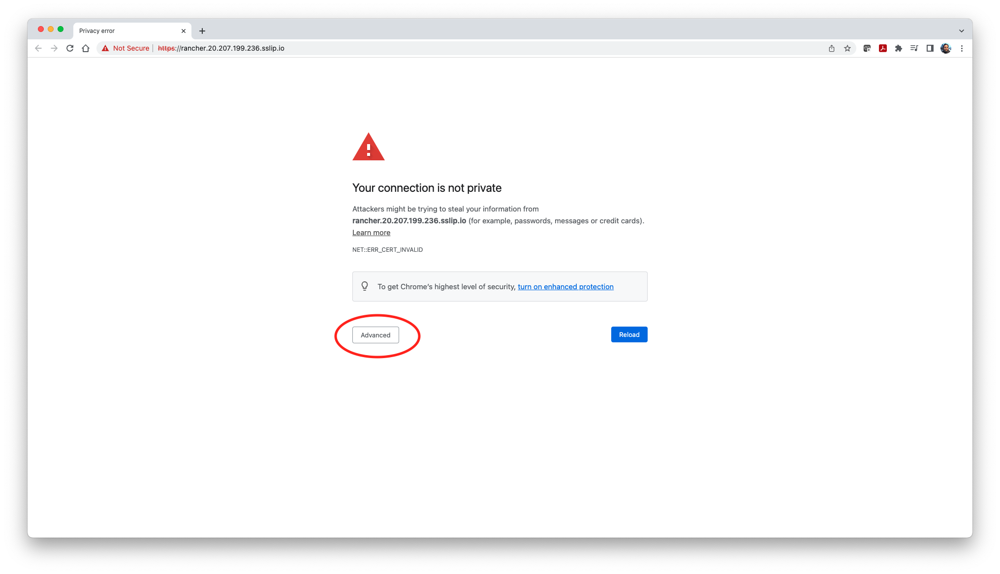
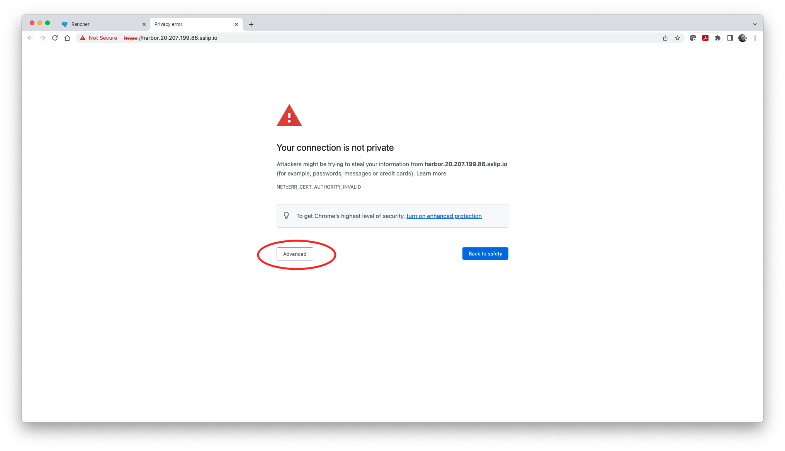
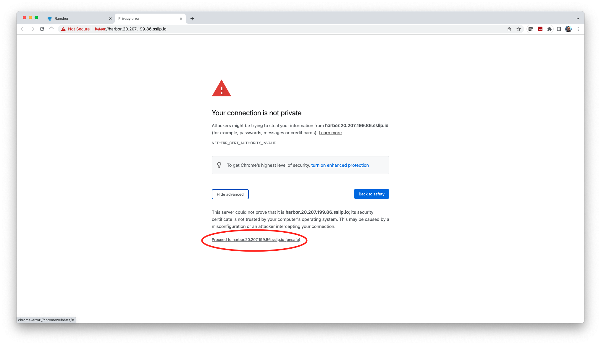
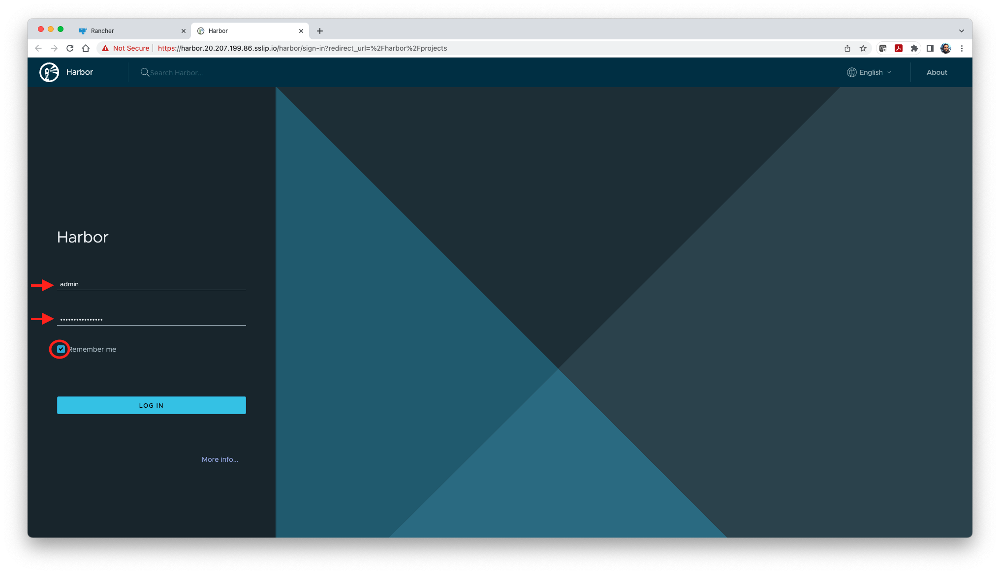
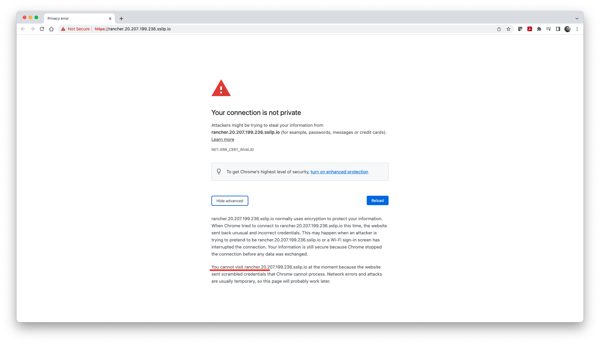
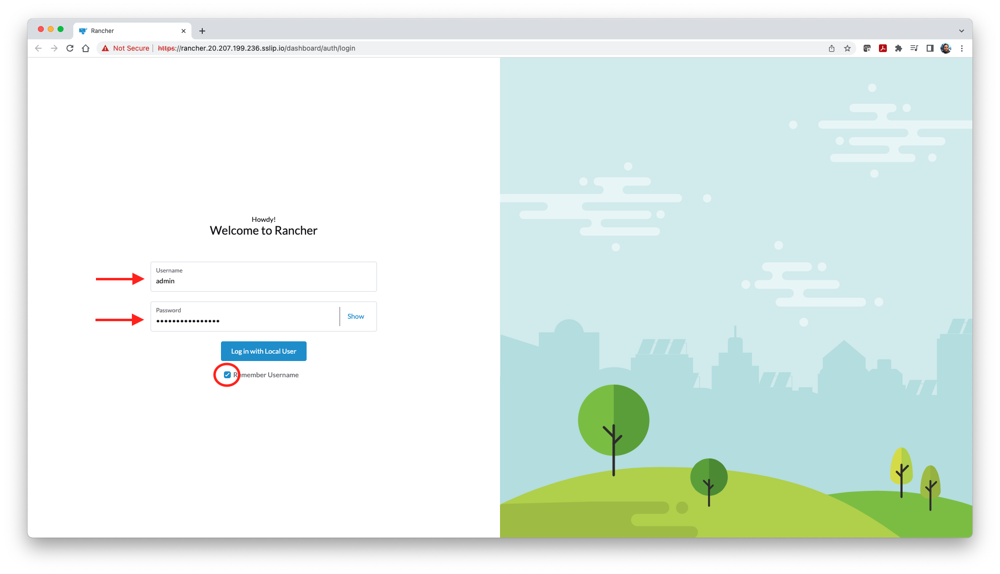

# Rancher and Private Registry Hands-on Workshop
This repository content provide the lab exercise guide for a hands-on workshop to help audience to understand and explore the open source technologies like Rancher and OPA in managing and securing containers on cloud based repositories like Azure Container Registry and/or private repositories such as Harbor.

## Pre-requisites

1. This Lab will require only chrome browser with fast and reliable internet connection. 

2. Make sure you have access to following urls behind your corporate firewall/personal computers. 

   Github (https://github.com/) 

   Sslip (*.sslip.io)

3. Watch presentation/demo on Cloud native trusted container registry for Kubernetes [TUT-1212]. You may asked to register if your visting first time.  

   https://reg.rainfocus.com/flow/suse/susecon22/SessionCatalog/page/SessionCatalog/session/16490787591920019KcD

4. If you want to spin this lab with your own personal/corporate Microsoft Azure Cloud account, please follow the link below:

​       https://github.com/dsohk/workshops/tree/main/scenarios/azure/rancher-harbor-acr  

5. Optional - Access to SUSE Partner Portal (https://myaccount.suse.com/)

## Open Source Technologies Used

| Software | Version         | Remarks                                                      |
| -------- | --------------- | ------------------------------------------------------------ |
| Rancher  | 2.6.6           | Enterprise-grade Kubernetes Management Platform              |
| RKE2     | v1.23.6+rke2r1  | Rancher Kubernetes Engine 2 - with Kubernetes version 1.23.6 |
| OPA      | 100.1.0+up3.7.1 | Open Policy Agent Gatekeeper: Policy and Governance for Kubernetes |
| Harbor   | v2.2.2-56d7937f | Project Harbor is an an open source trusted cloud native registry project that stores, signs, and scans content. |
| Trivy    | v0.16.0         | Aqua Trivy: Vulnerability and Misconfiguration Scanning      |

## Before We Begin

Before we start the lab, please make sure you have been provided with the following lab access credentials from the instructor. Each participant should have their own unique environment and credentials.

| Item                              | Value                                                      |
| --------------------------------- | ---------------------------------------------------------- |
| Rancher Server URL                | https://rancher.xx.xx.xx.xx.sslip.io                       |
| Rancher Server Username           | admin                                                      |
| Rancher Server Bootstrap Password | system assigned strong password                            |
| Harbor URL                        | https://harbor.yy.yy.yy.yy.sslip.io                        |
| Harbor Username                   | admin                                                      |
| Harbor Password                   | system assigned strong password                            |
| Azure Registry Server Name        | attendeexx.azurecr.io (for example, attendee99.azurecr.io) |
| Azure Registry User Name          | attendeexx (for example, attendee99)                       |
| Azure Registry Password           | (system assigned strong password)                          |

### Step 1 - Access Rancher and Harbor Portals

a) With a Google Chrome browser, access Rancher Server URL (https://rancher.xx.xx.xx.xx.sslip.io). If you are greeted by an invalid SSL certificate error message, please follow the Note*.

b) Enter the admin credentials to login i.e. `Username: admin`  and `Password: system assigned strong password`. 

c) When it's successful, you will be landing on the Rancher Home page. 

d) Do the same for Harbor URL (https://harbor.yy.yy.yy.yy.sslip.io). You will then be led to Harbor login page. If you are greeted by an invalid SSL certificate error message, please follow the Note*.

e) Enter the admin credentials to login i.e. `Username: admin`  and `Password: system assigned strong password`. 

##### *Note: 

If you are greeted by an invalid SSL certificate error message, you can click on the **Advanced** button

Rancher:

Harbor:

Click the Proceed to https://rancher.xx.xx.xx.xx.sslip.io and/or https://harbor.yy.yy.yy.yy.sslip.io hyperlink to continue. 

Now the login page will be displayed and proceed to authenticate yourself by entering username and password.

If link isn't shown, click on the empty space on browser and type the word `thisisunsafe` without any spaces to bypass the warning message. 

Now the login page will be displayed and proceed to authenticate yourself by entering username and password.

**End of Step 1**

## Lab Exercises

This lab is consiting of 3 exercises 

* ##### Exercise-01
  
  * [A-Scanning container image for vulnerabilities through Trivy on Harbor](https://github.com/dsohk/rancher-private-registry-workshop/blob/main/docs/Exercise-01A-ScanContainerImages.md)
  * [B-Setting up Harbor as a proxy to SUSE Registry and replicating images to Harbor](https://github.com/dsohk/rancher-private-registry-workshop/blob/main/docs/Exercise-01B-SetupHarborProxySUSERegistryReplicate.md)
  
  
  
* ##### Exercise-02
  
  * [A-Integrate Harbor with Rancher](https://github.com/dsohk/rancher-private-registry-workshop/blob/main/docs/Exercise-02A-IntegrateHarborwithRancher.md)
  * [B-Deploy sample applications from Harbor Registry onto RKE2 cluster ](https://github.com/dsohk/rancher-private-registry-workshop/blob/main/docs/Exercise-02B-DeploySampleApplication.md)
  
  
  
* ##### Exercise-03
  
  * [A-Installing and setting OPA constraint on RKE2 cluster](https://github.com/dsohk/rancher-private-registry-workshop/blob/main/docs/Exercise-03A-InstallOPA.md)
  * [B-Validate OPA Gatekeeper](https://github.com/dsohk/rancher-private-registry-workshop/blob/main/docs/Exercise-03B-TestOPAConstraintForHarborDocker.md)

##### Bonus Lab Exercise (Independent - Self learning)

* [Bonus Lab Exercise](https://github.com/dsohk/rancher-private-registry-workshop/blob/main/docs/BonusExercise-01.md)

## References

* [Rancher Documentation](https://rancher.com/docs/rancher/v2.6/en/)
* [Harbor Documentation](https://goharbor.io/docs/2.2.0/)
* [OPA Documentation](https://www.openpolicyagent.org/docs/latest/)
* [SUSE Registry](https://registry.suse.com/)

