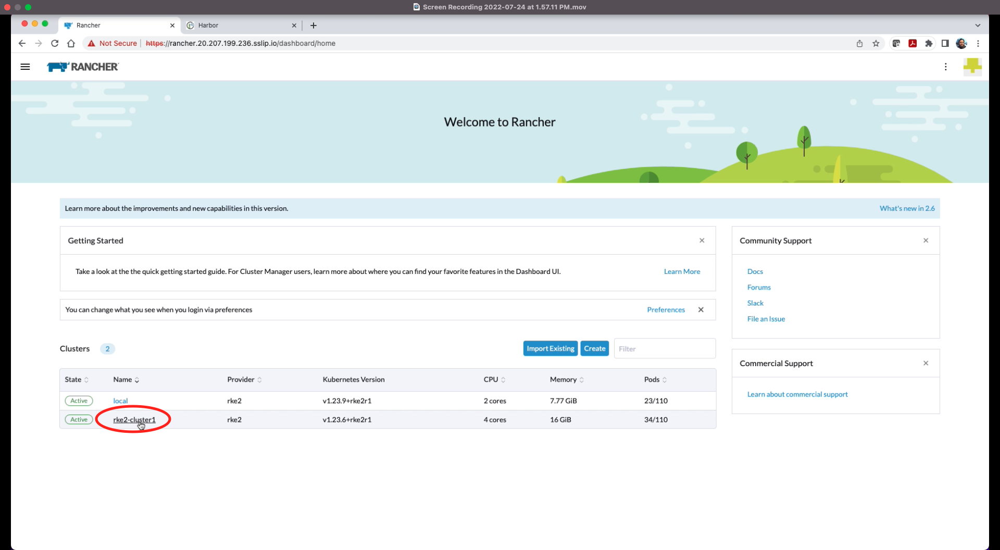

# Bonus Lab Exercise

This exercise is independent. 

- Create a new seceret in Rancher for Azure Container Registry (ACR). 
- Create ACR endpoint in Harbor 
- Create Push-based replication to ACR in Harbor 
- Deploy sample application on downstream RKE2 cluster by pulling image from ACR

## Action 1: Create a new seceret in Rancher for ACR

**Step BL.1)** Ensure that you are logged in to the Rancher (Refer to the Step 1 of section **Before We Begin**). Click on downstream cluster `rke2-cluster1` from the clusters list on Rancher home page.

**Step BL.2)** Click on `Storage` from left-hand static menu. 

**Step BL.3)** Click on `Secrets` under **Storage** and then click on `Create` on the main screen.

**Step BL.4)** Click on `Registry` option.

**Step BL.5)** Fill in following details and click on `Create`. 

`Namespace : default`

`Name : User's choice e.g. azure-cr`

`Data : Custom (Default choice)`

`Registry Domain Name : Azure Registry Servername i.e. attendeexx.azurecr.io`

`Username : Azure Registry Username e.g. attendeexx`

`Password : system generated strong password`

**Step BL.6)** Verify that harbor registry seceret  is successfully registered.

**End of Action 1**

**End of Bonus Exercise**

