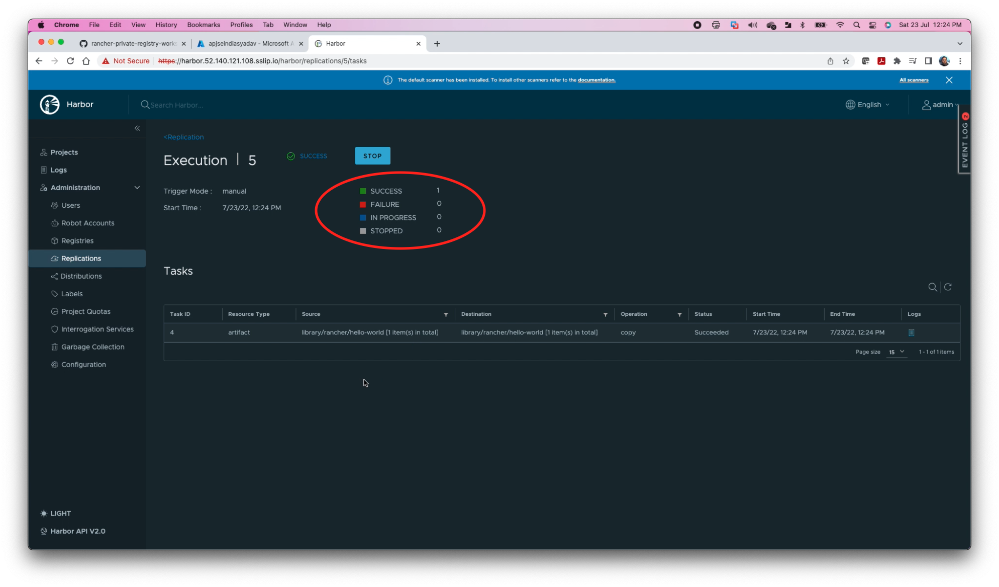

# Bonus Lab Exercise

This exercise is independent. 

- Create a new seceret in Rancher for Azure Container Registry (ACR). 
- Create ACR endpoint in Harbor 
- Create Push-based replication to ACR in Harbor 
- Validate deployment - pulling container image from ACR
- Fix OPA Constraint to allow ACR 
- Re-validate deployment - pulling container image from ACR


## Action 1: Create a new seceret in Rancher for ACR

This action will involve 6 steps from BL.7 to BL.10

**Step BL.1)** Ensure that you are logged in to the Rancher (Refer to the Step 1 of section **Before We Begin**). Click on downstream cluster `rke2-cluster1` from the clusters list on Rancher home page.


**Step BL.2)** Click on `Storage` from left-hand static menu. 


**Step BL.3)** Click on `Secrets` under **Storage** and then click on `Create` on the main screen.


**Step BL.4)** Click on `Registry` option.


**Step BL.5)** Fill in following details and click on `Create`. 

`Namespace : default`

`Name : User's choice e.g. azure-cr`

`Data : Custom (Default choice)`

`Registry Domain Name : Azure Registry Servername i.e. attendeexx.azurecr.io`

`Username : Azure Registry Username e.g. attendeexx`

`Password : system generated strong password`


**Step BL.6)** Verify that harbor registry seceret  is successfully registered.


**End of Action 1**


## Action 2: Create ACR Endpoint in Harbor

This action will involve 4 steps from BL.7 to BL.10

**Step BL.7)** Ensure that you are logged in to the Harbor (Refer to the Step 1 of section Before We Begin). Click on `Registries` from the lefst side menu under the **Administration**


**Step BL.8)** Click on `+ NEW ENDPOINT` from Registris screen


**Step BL.9)** A pop-up screen will appear to fill in the following details and then click on `TEST CONNECTION`

```
Provider : Azure ACR
Name : user's choice e.g. rancher-demo-acr-harbor-proxy
Endpoint URL : ACR Registry Server Name e.g. https://attendeexx.azurecr.io
Access ID : Azure Registry User Name e.g. attendeexx
Access Secret : Azure Registry Password i.e.(system assigned strong password)
```

After filling the correct details, you'll receive an inline message `Connection tested successfully` on top of the pop-up window.


**Step BL.10)** Click `OK`  and verify that endpoint is listed Healthy. 


**End of Action 2**


## Action 3: Replicate container image to ACR

This action will involve 6 steps from BL.11 to BL.16

**Step BL.11)** Click on `Replications` from the lefst side menu under the **Administration**


**Step BL.12)** Click on `+ NEW REPLICATION RULE` and it will show a pop-up window to fill details.


**Step BL.13)** Fill following details and click on `SAVE`

```
Name : as per user's choice e.g. replicate-to-acr
Replication method : Push-based
Destination registry : select endpoint value from dropdown e.g. rancher-demo-acr-harbor-proxy - https://attendeexx.azurecr.io
Trigger Method : Event Based (slect value from dropdown)
Delete remote resources when locally deleted : Checked
```


**Step BL.14)** Click on radio button of the created rule and click on `REPLICATE`


**Step BL.15)** A confimation message "Do you want to replicate the rule `newly create rule name`?". Click on `REPLICATE`


Verify that `InProgress` status is shown under **Execution** section. 


**Step BL.16)** After successful replication, status will be updated to `Succeeded`. Now click on the link under **ID** column. 


A screen with show the details of replication.



**End of Action 3**


## Action 4: Validate deployment - pulling container image from ACR 

This action will involve 2 steps from BL.17 to BL.18

**Step BL.17)** Make sure that you are in Create mode on Rancher's Deployment screen `(rke2-cluster1 > Workload > Deployments)`. Fill in the following details and click on `Create` button. 

```
Namespace : default
Name : user's choice e.g. acr-hello-world
Container Image : attendeexx.azurecr.io/library/hello-world:v0.1.2
Pull Seceret : as specified for acr (From dropdown) e.g. azure-cr
Service Type : Node Port (From the dropdown)
Private Container Port : 80
```


**Step BL.18)** Verify that deployment has failed due to the OPA Constraint which doesn't whitelist ACR. 


**End of Action 4**

## Action 5: Fix OPA Constraint to allow ACR  

This action will involve 2 steps from BL.19 to BL.20

**Step BL.19)** Navigate to the Rancher's OPA Gatekeeper Constraint screen (rke2-cluster1 > OPA Gatekeeper > Constrains). Go to the extreme right and click on 3 vertical dots against the K8SAllowedRepos i.e.  `allowed-registries`  and click on `Edit Config`.

**Step BL.20)** Click on Parameters link and edit Parameter section to include ACR. Click on Save.  


**End of Action 5**


## Action 6: Validate deployment - pulling container image from ACR 

This action will involve 6 steps from BL.21 to BL.26

**Step BL.21)** Navigate to the Rancher's Deployment page `(rke2-cluster1 > Workload > Deployments)` and click on  `Create` button on the top right side of the screen. 


**Step BL.22)** Fill in following details and click on `Create`

```
Namespace : default
Name : user's choice e.g. acr-hello-world
Container Image : attendeexx.azurecr.io/library/hello-world:v0.1.2
Pull Seceret : as specified for acr (From dropdown) e.g. azure-cr
Service Type : Node Port (From the dropdown)
Private Container Port : 80
```


**Step BL.23)** Verify that deployment is successfully created and click on the hyperlink of the deployment under **Name** column. 


**Step BL.24)** Verify that 1 Pod is in Running state. 


**Step BL.25)** Click on `Service Discovery (1)` option from the left hand static menu and then click on `Services (2)`  submenu under the Service Discovery. Now click on the link `3nnnn/TCP (3)` under **Target** column.


**Step BL.26)** Verify that Rancher's Hello world application is accessible on designated Node Port. 


**End of Action 6**

**End of Bonus Exercise**

