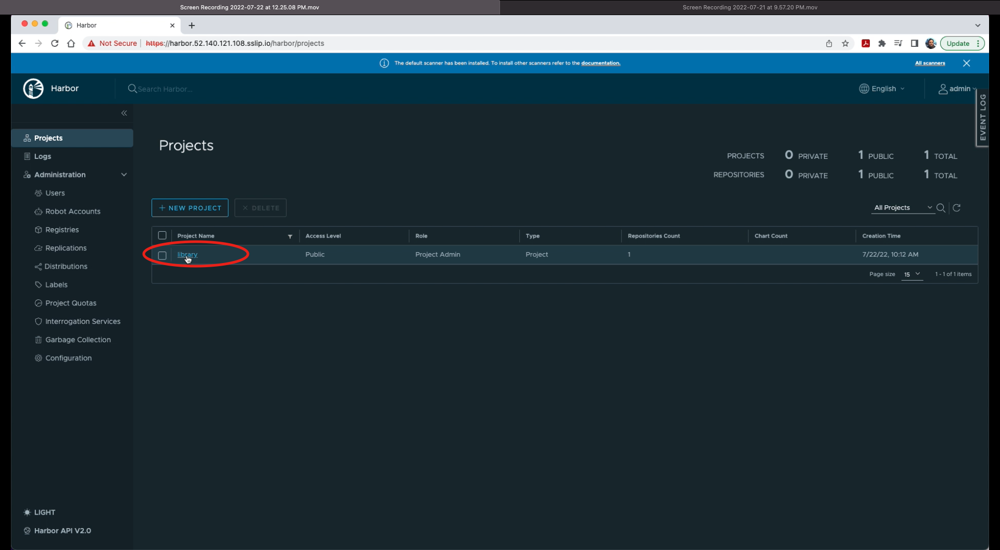
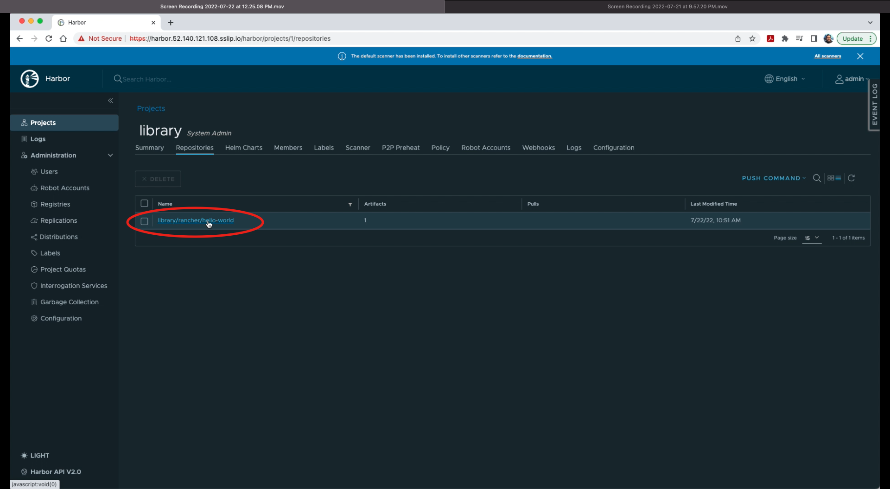
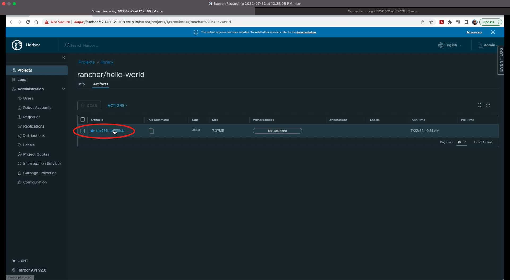
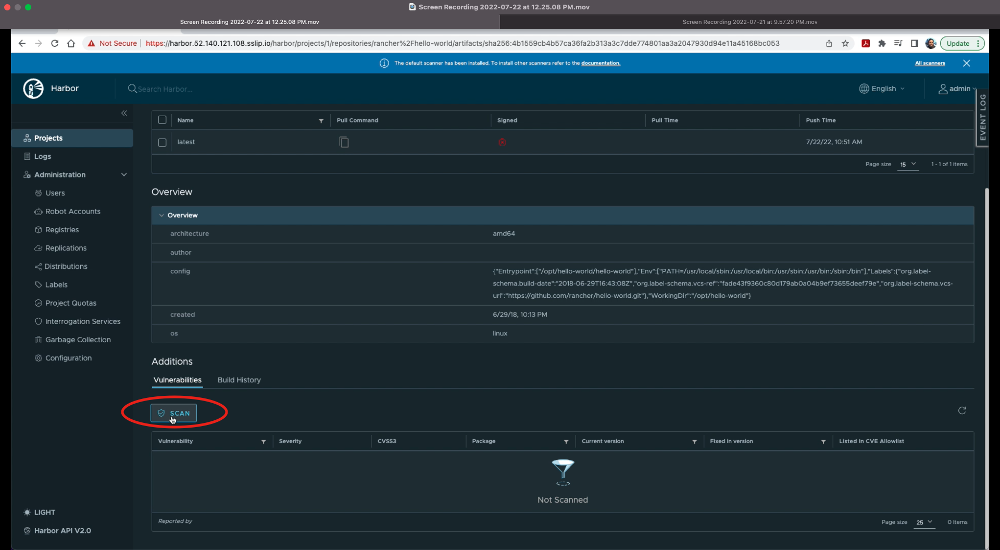
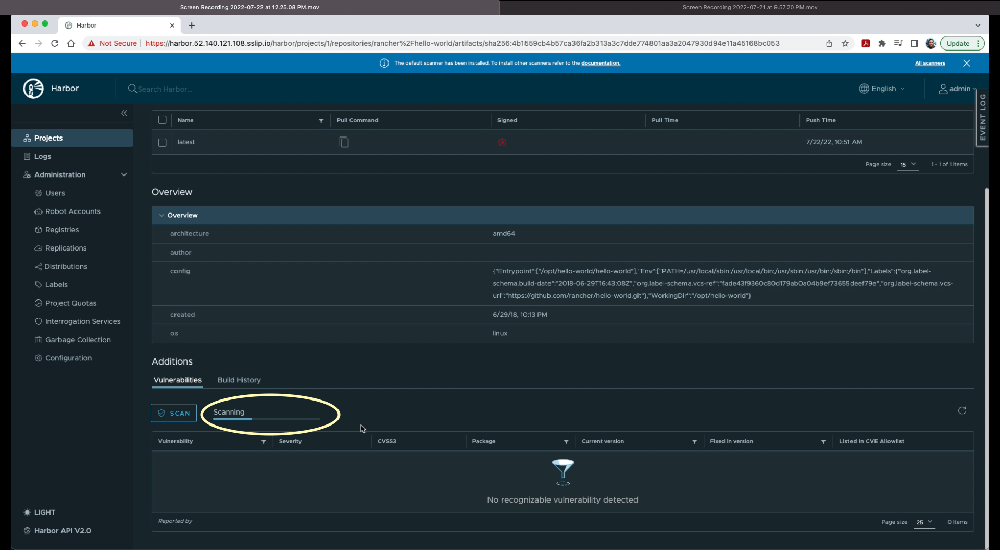
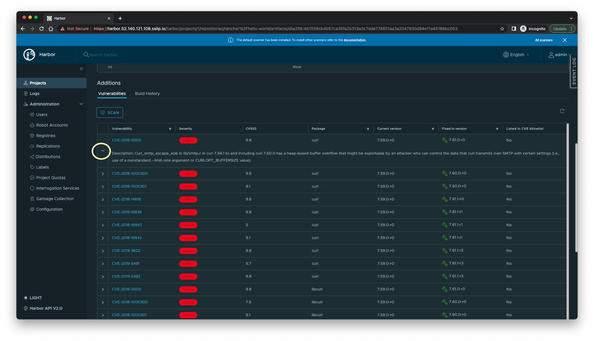

# Lab 1 A - Scanning container image for vulnerabilities through Trivy on Harbor

In this exercise, we are login to the harbor portal and using native scanning tool Trivy for vulnarabilities. It has 2 main steps loging the harbor portal and scanning pre-loaded container image for vulnarabilities. 

## Scan preloaded container image rancher/hello-world:latest

This exercise will involve 5 steps. 

**Step 1A.1)** Ensure that you are logged in to the Harbor (Refer to the Step 1 of section Before We Begin). On Harbor Home page, click the `library` link on main screen under Project Name column. 

**Step 1A.2)** Click on link `library/rancher/hello-world` under Name column

**Step 1A.3)** Click on container image link `sha256:xxxxxxxx` under **Artifacts** column. Verify that `latest` is shown under the **Tags** column and **Vulnarabilities** column shows **`Not Scanned`** 

**1A.4)** Scroll down to the bottom at **Additions** section and click on `SCAN` under **Vulnarabilities** sub-section.

Immediately after clicking SCAN, you'll notice **Queued** indicator

And it will start Scanning. 

**1A.5)** After successful scan, a result will be shown with following details 

`Vulnerability` i.e. CVE Number, `Severity` i.e. Critical, High, Medium etc., `CVSS3` i.e. Common Vulnarability Score as per CVSS Version 3.0, `package`, `Current version`, `Fixed in version` and `Listed in CVE Allowlist` . Clicking on arrow (>) sign will provide detailed description. 

**End of Exercise 1A**

Continue to: [Exercise 1B-Setting up Harbor as a proxy to Azure Container Registry (ACR) and replicating images to ACR](https://github.com/dsohk/rancher-private-registry-workshop/blob/main/docs/Exercise-01B-SetupHarborProxyReplicateACR.md)