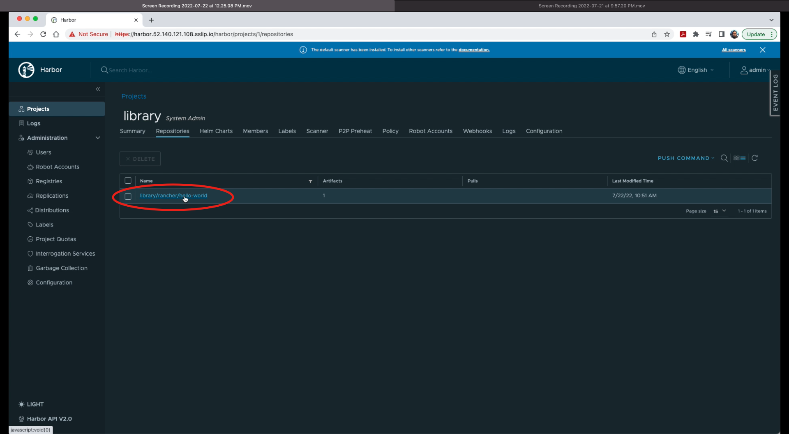
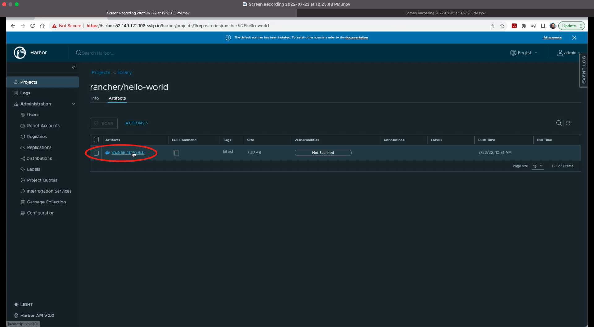
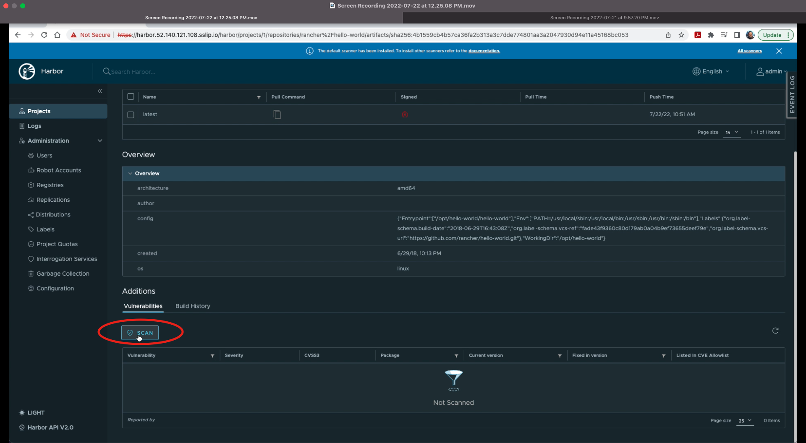
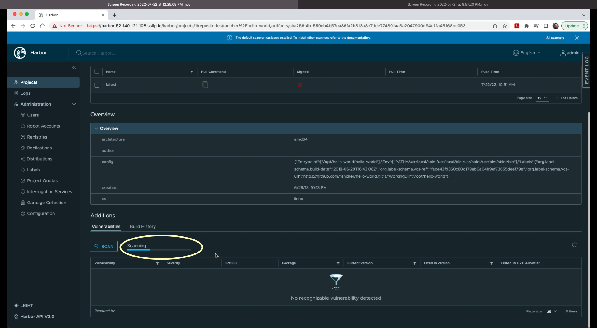
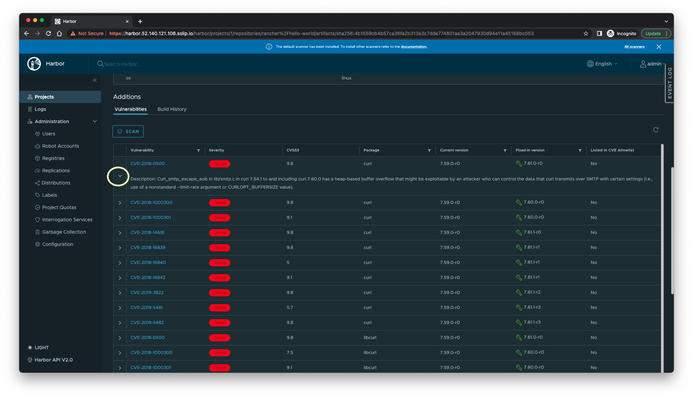

# Lab 1 A - Scanning container image for vulnerabilities through Trivy on Harbor

In this exercise, we are login to the harbor portal and using native scanning tool Trivy for vulnarabilities. It has 2 main steps loging the harbor portal and scanning pre-loaded container image for vulnarabilities. 

## Before We Begin

Before we start the lab, please make sure you have been provided with the following lab access credentials from the instructor. Each participant should have their own unique environment and credentials.

| Item                              | Value                                                      |
| --------------------------------- | ---------------------------------------------------------- |
| Rancher Server URL                | https://rancher.xx.xx.xx.xx.sslip.io                       |
| Rancher Server Username           | admin                                                      |
| Rancher Server Bootstrap Password | (system assigned strong password)                          |
| Harbor URL                        | https://harbor.yy.yy.yy.yy.sslip.io                        |
| Harbor Username                   | admin                                                      |
| Harbor Password                   | (system assigned strong password)                          |
| Azure Registry Server Name        | attendeexx.azurecr.io (for example, attendee99.azurecr.io) |
| Azure Registry User Name          | attendeexx (for example, attendee99)                       |
| Azure Registry Password           | (system assigned strong password)                          |

## Step 1 - Access Harbor Portal

With a Google Chrome browser, navigate to the Harbor URL (https://harbor.yy.yy.yy.yy.sslip.io). If you are greeted by an invalid SSL certificate error message, you can click on the **Advanced** button and click the Proceed to https://harbor.yy.yy.yy.yy.sslip.io hyperlink to continue to https://harbor.yy.yy.yy.yy.sslip.io isn't shown, click on the empty space on browser and type the word `thisisunsafe` without any spaces on this page to bypass the warning message. 

You will then be led to Harbor login page. Enter the admin credentials to login. When it's successful, you will be landing on the Harbor Home page. 

**End of Step 1**

## Step 2 - Scan preloaded container image rancher/hello-world:latest

 

a) On Harbor Home page, click the `library` link on main screen under Project Name column. 

b) Click on link `library/rancher/hello-world` under Name column

c) Click on container image link `sha256:xxxxxxxx` under **Artifacts** column. Verify that `latest` is shown under the **Tags** column and **Vulnarabilities** column shows **`Not Scanned`** 

d) Scroll down to the bottom at **Additions** section and click on `SCAN` under **Vulnarabilities** sub-section.

Immediately after clicking SCAN, you'll notice **Queued** indicator

And it will start Scanning. 

e) After successful scan, a result will be shown with following details 

`Vulnerability` i.e. CVE Number, `Severity` i.e. Critical, High, Medium etc., `CVSS3` i.e. Common Vulnarability Score as per CVSS Version 3.0, `package`, `Current version`, `Fixed in version` and `Listed in CVE Allowlist` . Clicking on arrow (>) sign will provide detailed description. 

**End of Step 2**