# Lab 1 B - Setting up Harbor as a proxy to Azure Container Registry (ACR) and replicating images to ACR

In this exercise, we'll continue from the previous step of Lab 1 A. We'll create a new registry endpoint of ACR in Harbor and create a new project for the newly created endpoint and enable Harbor as proxy. 

## Action 1: Create ACR Endpoint in Harbor

This action will involve 5 steps from 1B.1 to 1B.5

**Step 1B.1)** Ensure that you are logged in to the Harbor (Refer to the Step 1 of section Before We Begin). Click on `Registries` from the lefst side menu under the **Administration**

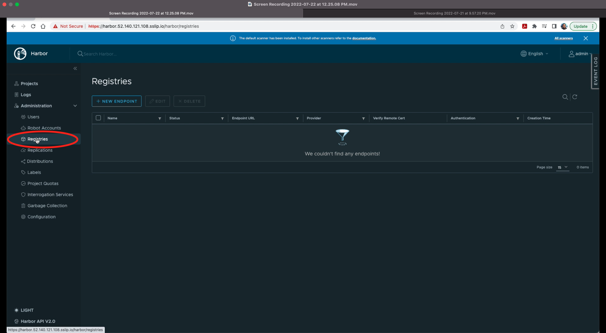

**Step 1B.2)** Click on `+ NEW ENDPOINT` from Registris screen

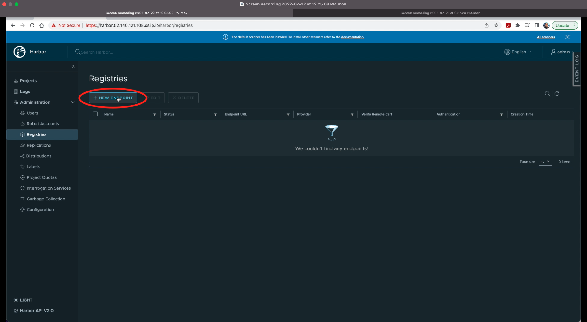

**Step 1B.3)** A pop-up screen will appear to fill in the following details and then click on `TEST CONNECTION`

`Provider : Azure ACR`

`Name : user's choice e.g. rancher-demo-acr-harbor-proxy`

`Endpoint URL : ACR Registry Server Name e.g. https://attendeexx.azurecr.io`

`Access ID : Azure Registry User Name e.g. attendeexx` 

`Access Secret : Azure Registry Password i.e.(system assigned strong password)`

After filling the correct details, you'll receive an inline message `Connection tested successfully` on top of the pop-up window.

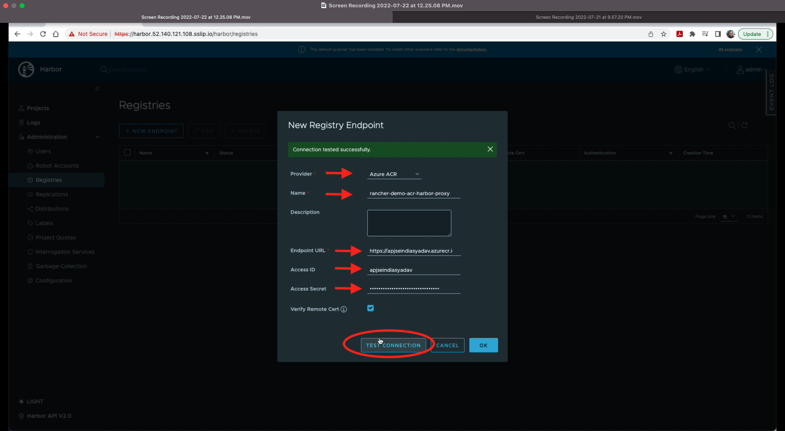

**Step 1B.4)** Click `OK`  and verify that endpoint is listed Healthy. 

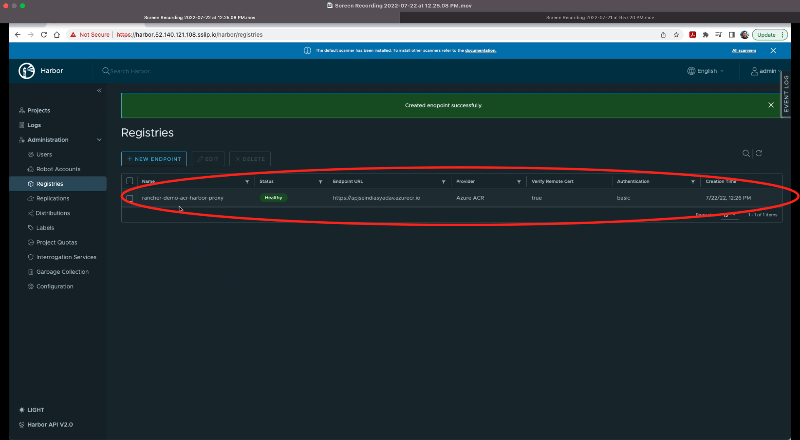

**End of Action 1**

## Action 2: Replicate container image to ACR

This action will involve 5 steps from 1B.6 to 1B.10

**Step 1B.5)** Click on `Replications` from the lefst side menu under the **Administration**

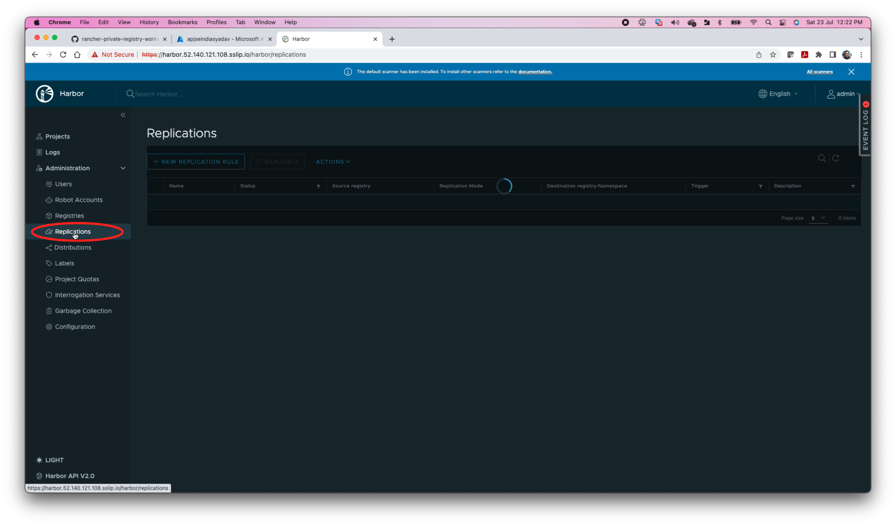

**Step 1B.6)** Click on `+ NEW REPLICATION RULE` and it will show a pop-up window to fill details.

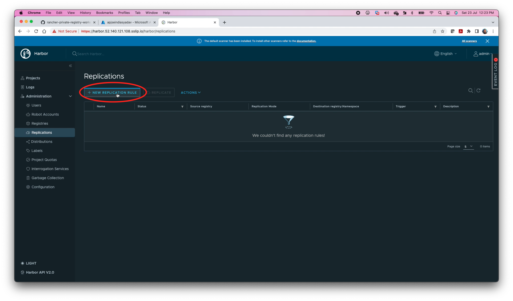

**Step 1B.7)** Fill following details and click on `SAVE`

`Name : as per user's choice e.g. replicate-to-acr`

`Replication method : Push-based`

`Destination registry : select endpoint value from dropdown e.g. rancher-demo-acr-harbor-proxy - https://attendeexx.azurecr.io`

`Trigger Method : Event Based (slect value from dropdown)`

`Delete remote resources when locally deleted : Checked`

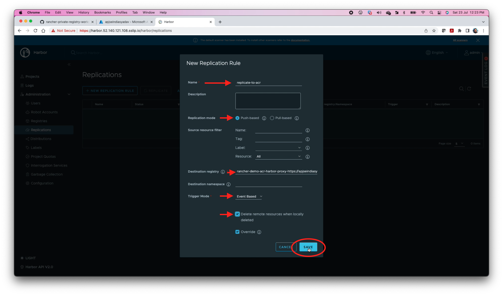

**Step 1B.8)** Click on radio button of the created rule and click on `REPLICATE`

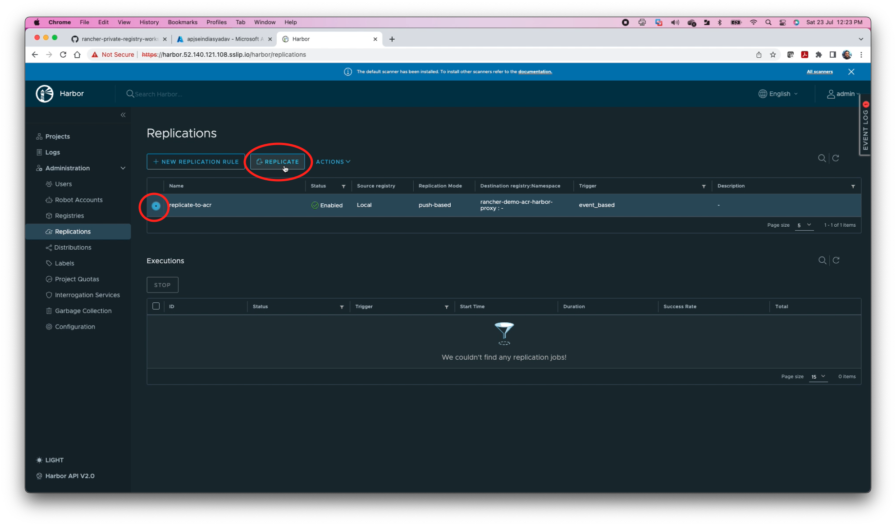

**Step 1B.9)** A confimation message "Do you want to replicate the rule `newly create rule name`?". Click on `REPLICATE`

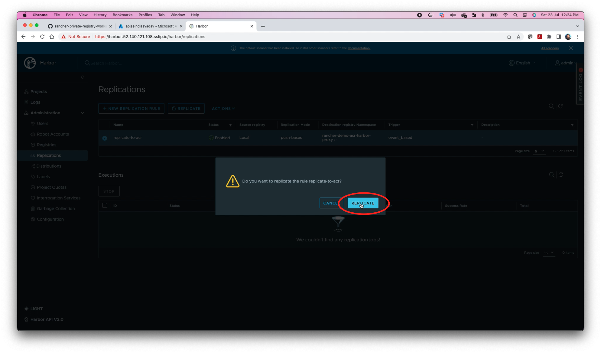

Verify that `InProgress` status is shown under **Execution** section. 

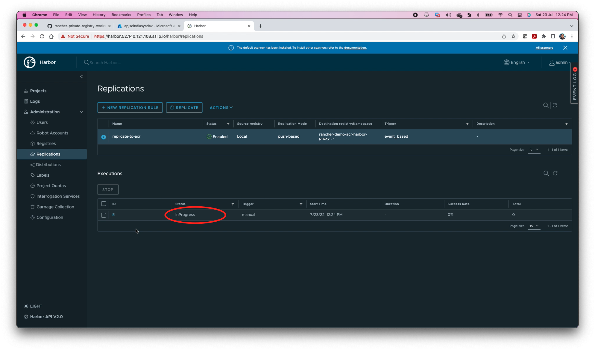

**Step 1B.10)** After successful replication, status will be updated to `Succeeded`. Now click on the link under **ID** column. 

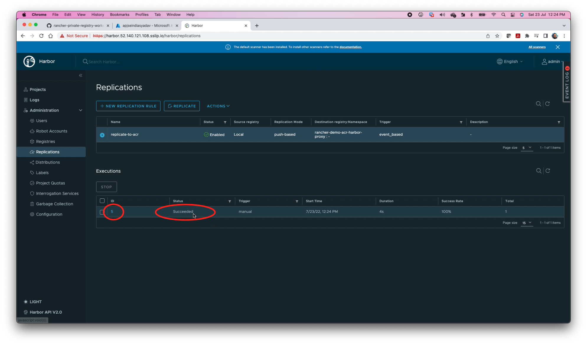

A screen with show the details of replication.

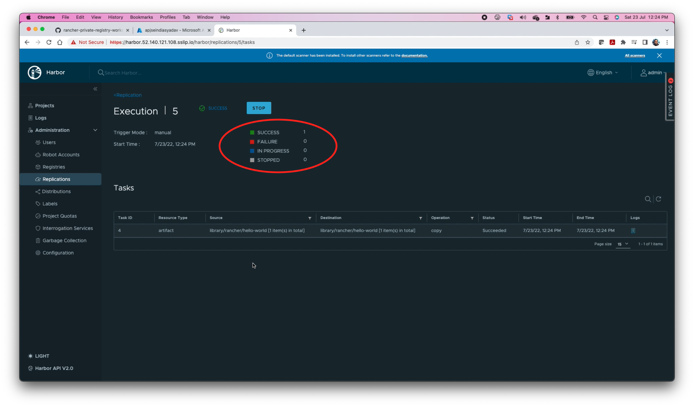

**End of Action 2**

**End of Exercise 1B**

Continue to: [Exercise 2A-Integrate Harbor and ACR with Rancher](https://github.com/dsohk/rancher-private-registry-workshop/blob/main/docs/Exercise-02A-IntegrateHarborACRwithRancher.md)