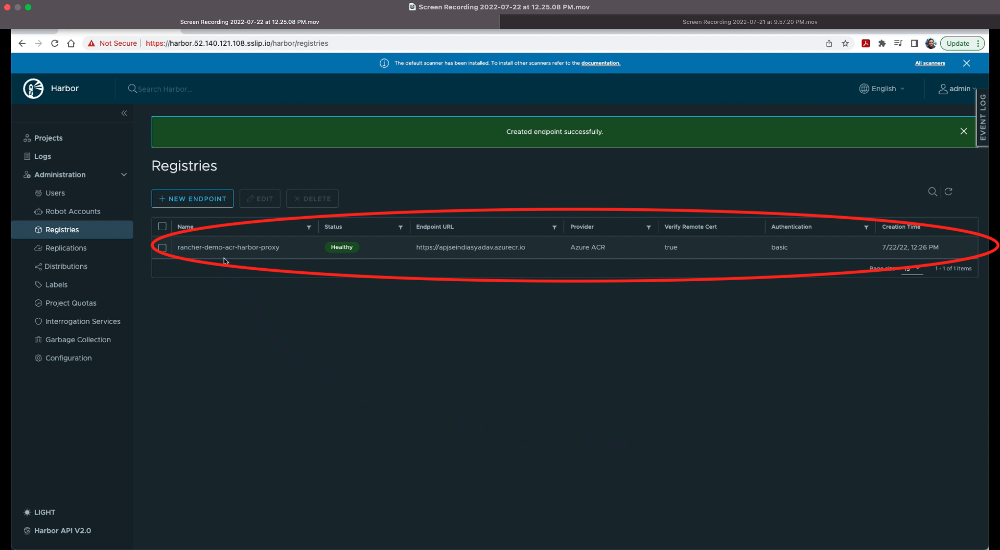

# Lab 1 B - Setting up Harbor as a proxy to Azure Container Registry (ACR) and replicating images to ACR

In this exercise, we'll continue from the previous step of Lab 1 A. We'll create a new registry endpoint of ACR in Harbor and create a new project for the newly created endpoint and enable Harbor as proxy. 

## Step 1 - Create ACR Endpoint in Harbor

a) Click on `Registries` from the lefst side menu under the **Administration**

b) Click on `+ NEW ENDPOINT` from Registris screen

c) A pop-up screen will appear to fill in the following details and then click on `TEST CONNECTION`

`Provider : Azure ACR`

`Name : user's choice e.g. rancher-demo-acr-harbor-proxy`

`Endpoint URL : ACR Registry Server Name e.g. https://attendeexx.azurecr.io`

`Access ID : Azure Registry User Name e.g. attendeexx` 

`Access Secret : Azure Registry Password i.e.(system assigned strong password)`

After filling the correct details, you'll receive an inline message `Connection tested successfully` on top of the pop-up window.

d) Click `OK`  and verify that endpoint is listed. 

