# Lab 1 B - Setting up Harbor as a proxy to SUSE  Registry and replicating images to Harbor

In this exercise, we'll continue from the previous step of Lab 1 A. We'll create a new registry endpoint of SUSE Registry in Harbor. 

## Action 1: Create SUSE Registry's Endpoint in Harbor

This action will involve 5 steps from 1B.1 to 1B.5

**Step 1B.1)** Ensure that you are logged in to the Harbor (Refer to the Step 1 of section Before We Begin). 

**Step 1B.2)** Click on `Registries` from the lefst side menu under the **Administration**. Now click on `+ NEW ENDPOINT` from Registris screen

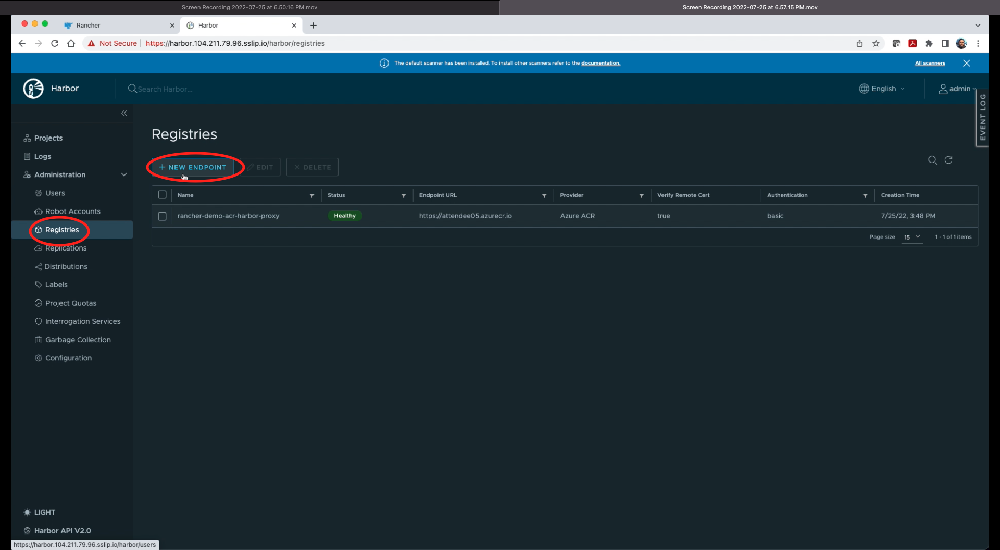

**Step 1B.3)** A pop-up screen will appear to fill in the following details and then click on `TEST CONNECTION`

`Provider : Docker Registry (From dropdown)`

`Name : user's choice e.g. suse-registry`

`Endpoint URL : https://registry.suse.com`

`Access ID : null` 

`Access Secret : null`

After filling the correct details, you'll receive an inline message `Connection tested successfully` on top of the pop-up window. Click `OK` .

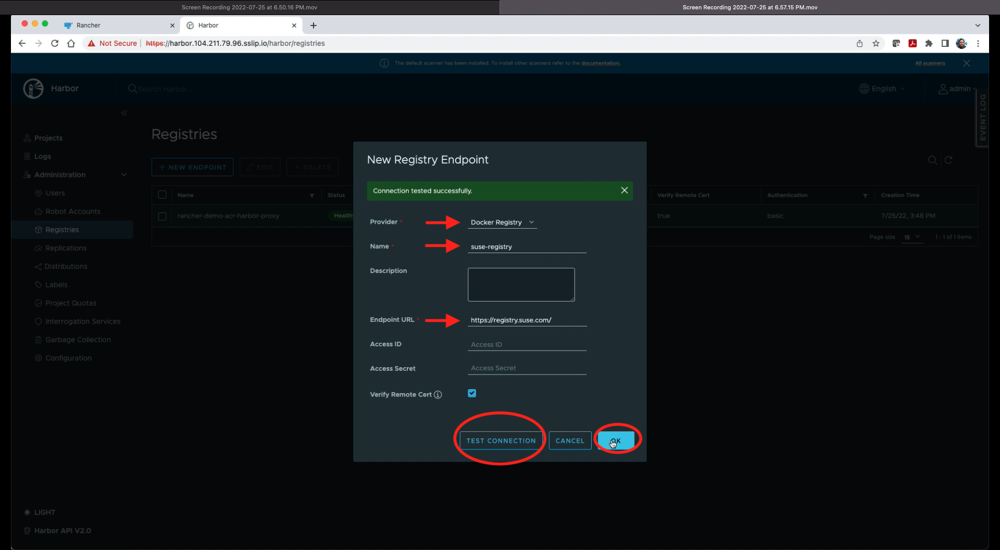

**Step 1B.4)** Verify that endpoint is listed Healthy. 

**End of Action 1**

## Action 2: Replicate container image to Harbor

This action will involve 5 steps from 1B.6 to 1B.10

**Step 1B.5)** Click on `Replications` from the left side menu under the **Administration**

**Step 1B.6)** Click on `+ NEW REPLICATION RULE` and it will show a pop-up window to fill details.

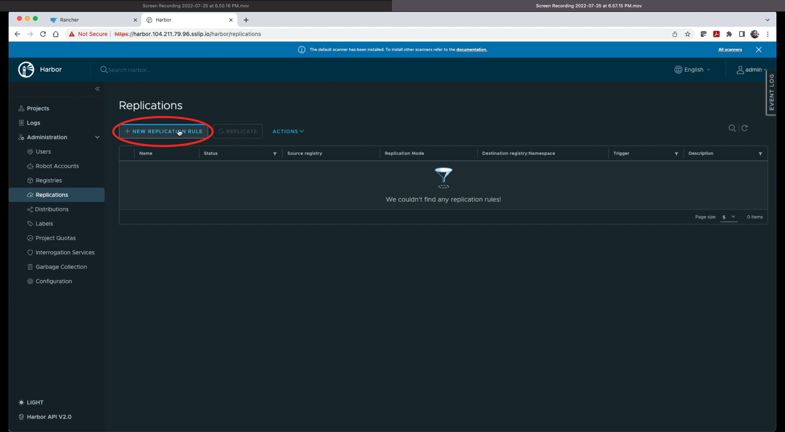

**Step 1B.7)** Fill following details and click on `SAVE`

`Name : as per user's choice e.g. suse-registry-to-harbor`

`Replication method : Pull-based`

`Destination registry : select endpoint value from dropdown e.g. suse-registry - https://registry.suse.com`

`Name : bci/bci-base`

`Tag : latest`

`Trigger Method : Manual (default from dropdown)`

`Override : Checked`

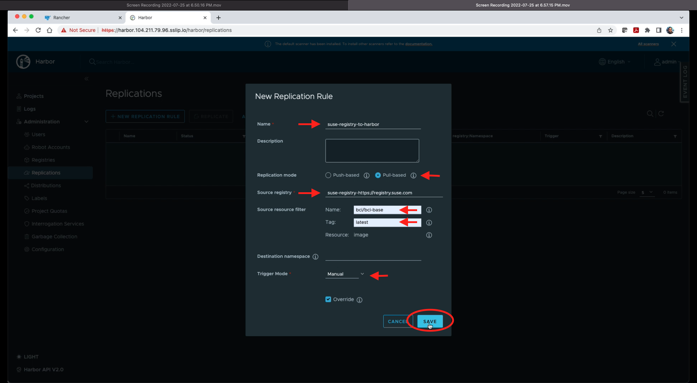

**Step 1B.8)** Click on radio button of the created rule and click on `REPLICATE`

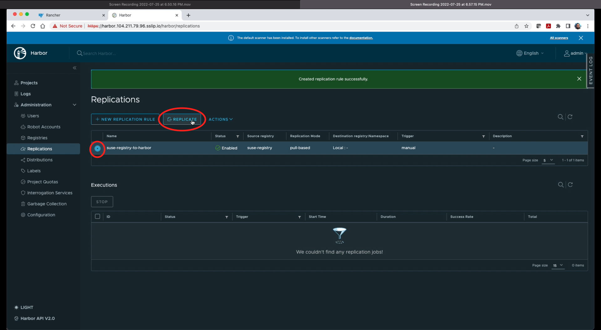

**Step 1B.9)** A confimation message "Do you want to replicate the rule `newly create rule name`?". Click on `REPLICATE`

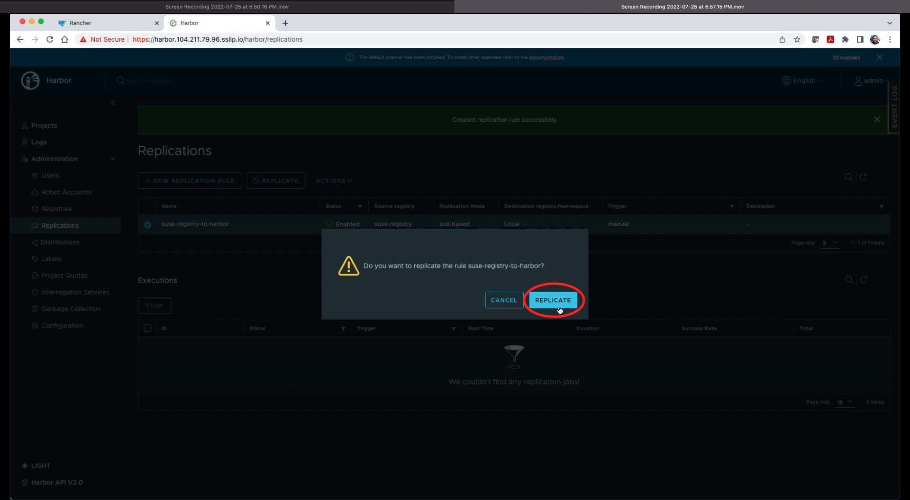

**Step 1B.10)** Verify that `InProgress` status is shown under **Execution** section. Click on the link under **ID** column. 

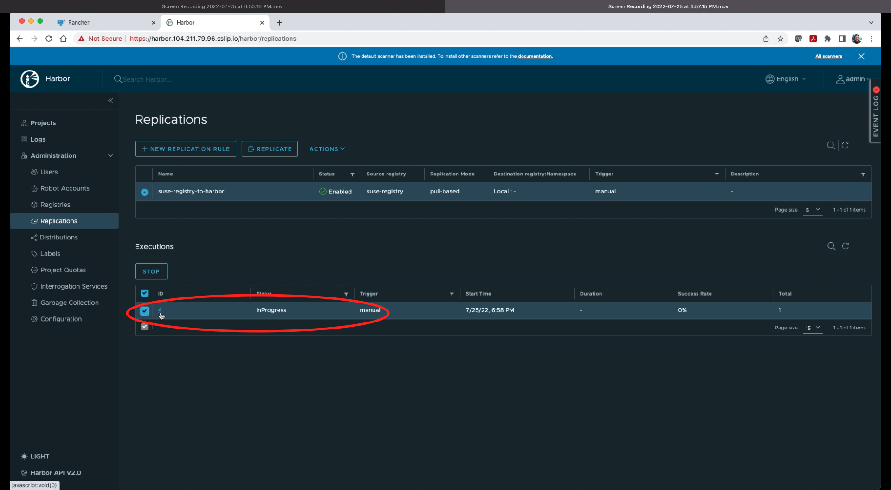

**Step 1B.10)** After successful replication, status will be updated to `Succeeded` from `Inprogress`. You can verify various event status on this page. 

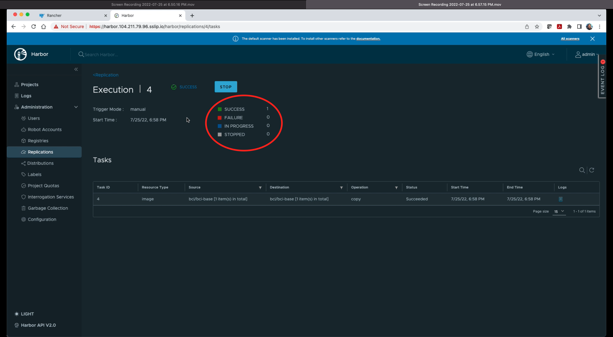

**End of Action 2**

## Action 3: Scan replicated base container image (bci) bci/bci-base:latest 

This action will involve 3 steps from 1B.11 to 1B.13. 

**Step 1B.11)** Click on `Projects` from the left side menu.  Verify that `bci` is listed under **Project Name** column. Click on `bci` link. 

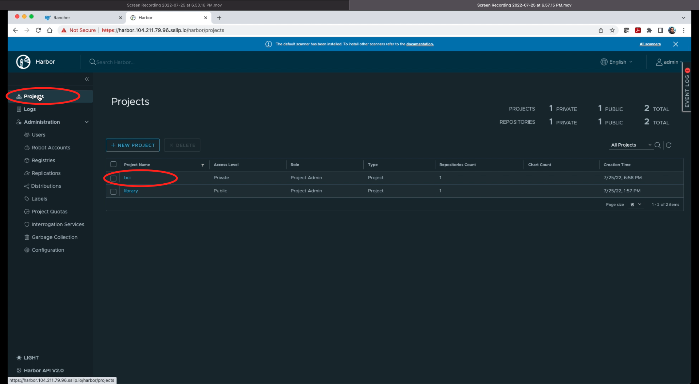

**Step 1B.12)** Verify that `bci/bci-base` is listed under Repositories **Name** column. Click on `bci/bci-base` link. 

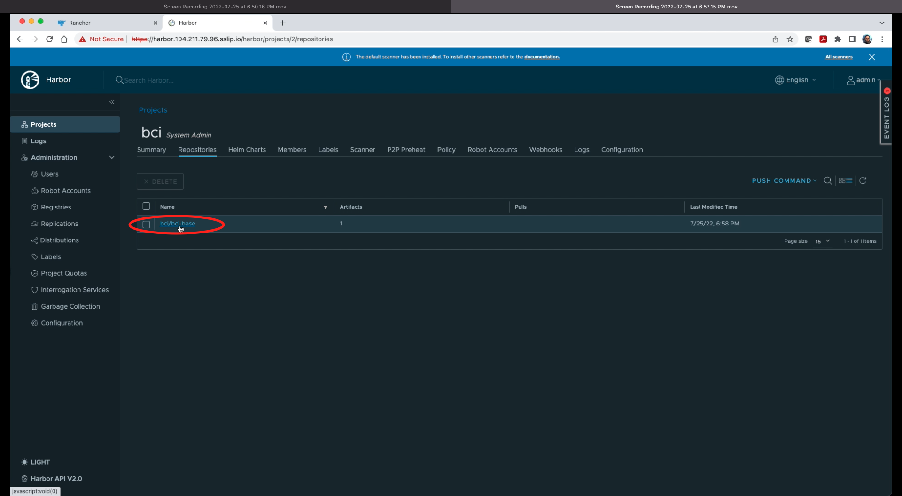

**Step 1B.13)** Verify that **Artifact** `sha256:xxxxxxxx` is listed and **Vulnerabilities** status is `Not Scanned`. Select the check box of **Artifact** `sha256-xxxxxxxx`  and click on `SCAN` button. 

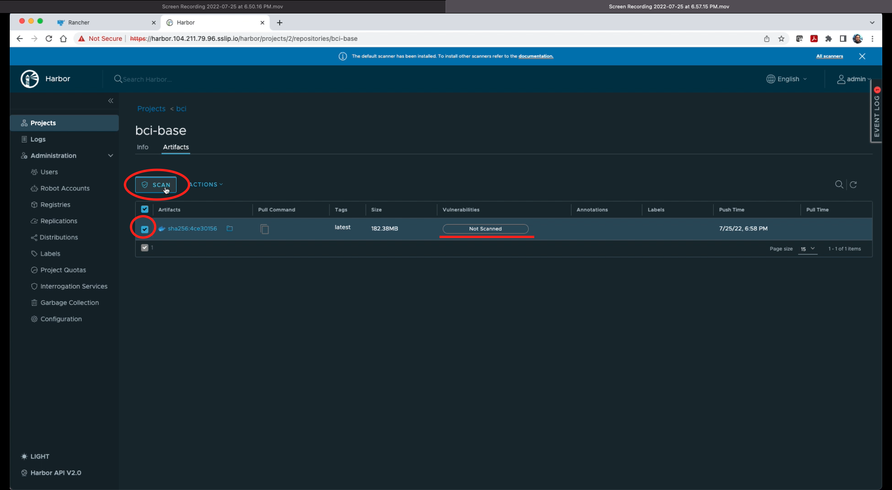

Verify that **Vulnerabilities** status is changed to `Queued`.

Now verify that scanning is completed and respective vulnerabilities are shown. Here in this case, nothing is found. 

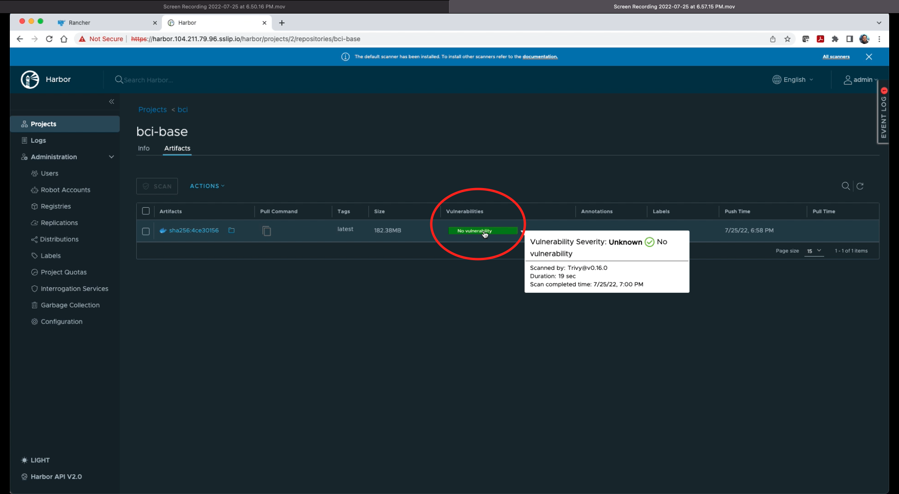

**End of Action 3**

**End of Exercise 1B**

Continue to: [Exercise 2A-Integrate Harbor and ACR with Rancher](https://github.com/dsohk/rancher-private-registry-workshop/blob/main/docs/Exercise-02A-IntegrateHarborACRwithRancher.md)