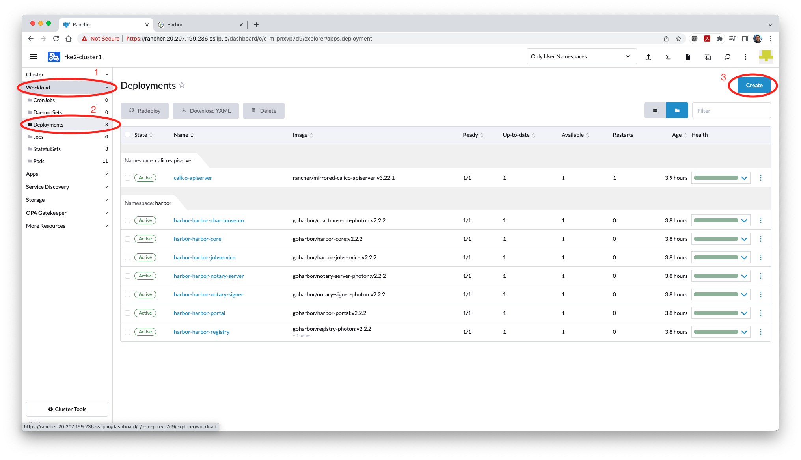
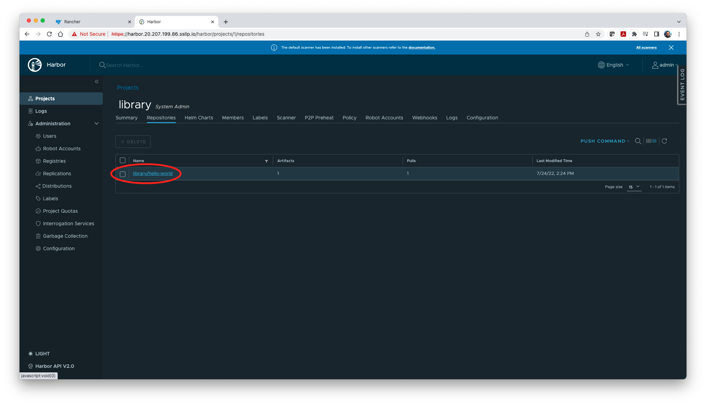
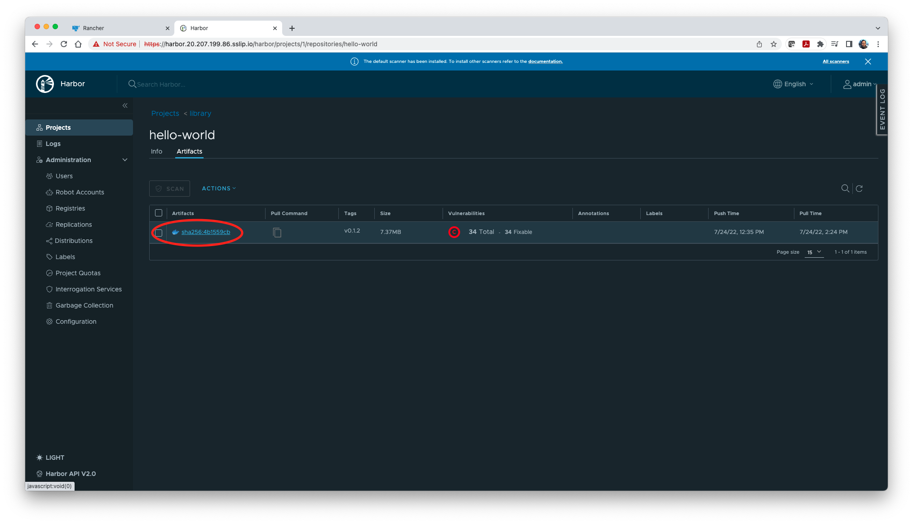
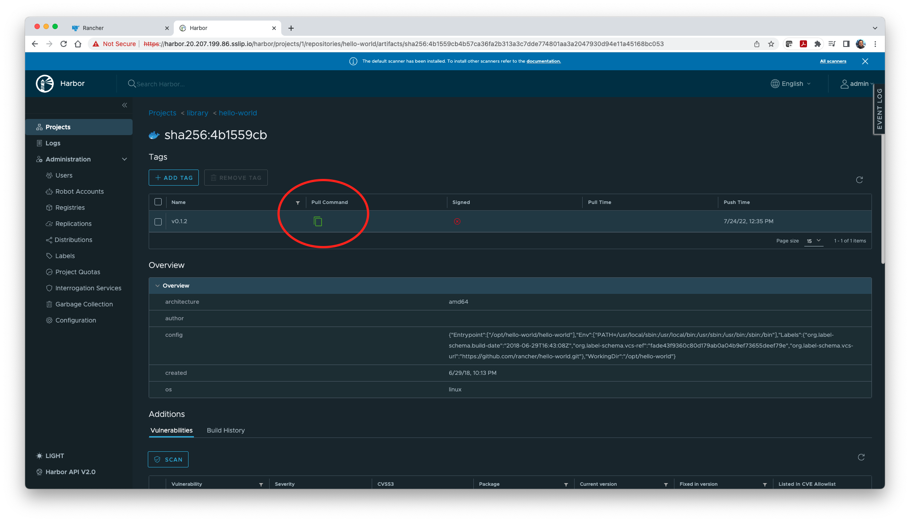
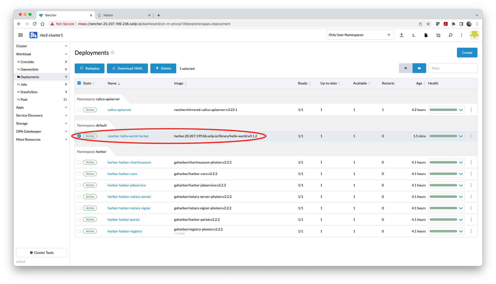
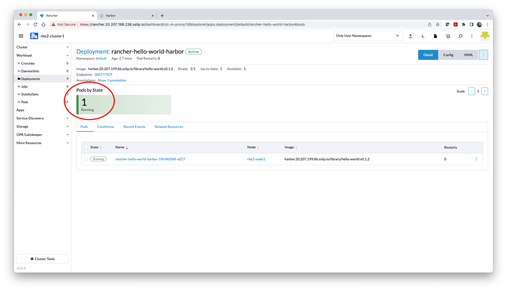
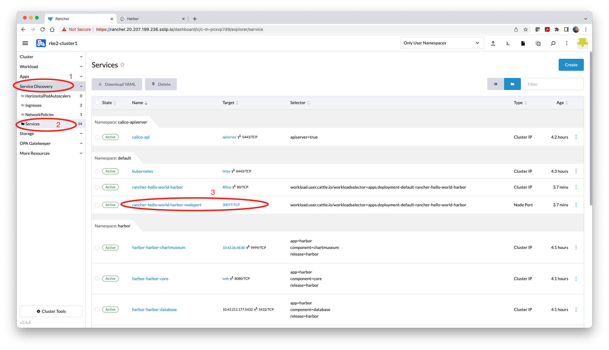
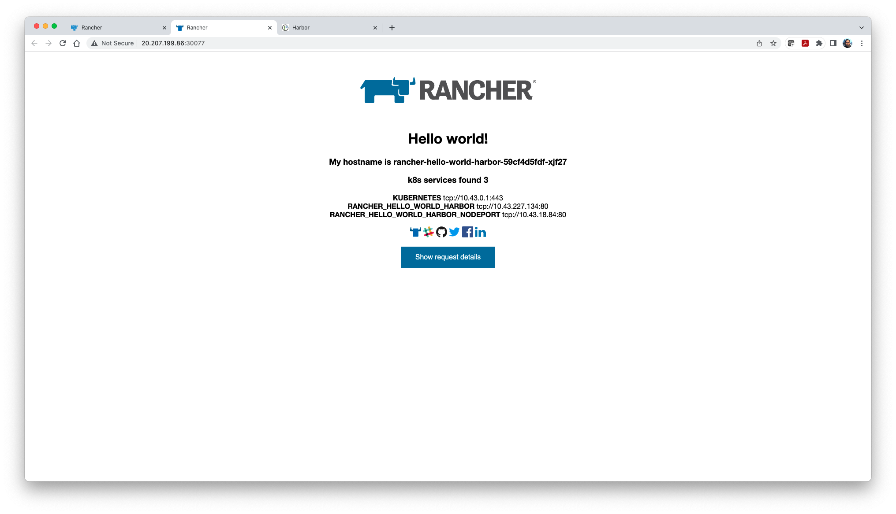

# Lab 2 B - Deploy sample applications from Harbor Registry onto RKE2 cluster

This exercise will continue from the previous Exercise 2B. We'll deploy a sample application rancher's hello-world from Harbor registry. It will require back and forth navation between Rancher and Harbor Portal. 

## Action 1: Prepare for deployment on Rancher 

This action will involve 2 steps from 2B.1 to 2B.2

**Step 2B.1)** Ensure that you are logged in to the Rancher (Refer to the Step 1 of section **Before We Begin**). Click on `Hamburger Menu icon (1)`. It will show list of clusters. Now click on downstream cluster `rke2-cluster1 (2)` from the clusters list.

**Step 2B.2)** Click on `Workload (1)` menu option and then click on `Deployments (2)`. Navigate to the right of the screen and click on `Create (3)`. 

**End of Action 1**

## Action 2: Copy pull command from Harbor 

This action will involve 4 steps from 2B.3 to 2B.6

**Step 2B.3)** Now you will need to specify container image location which needs to be copied from the Harbor portal. Ensure that you are logged in to the Harbor (Refer to the Step 1 of section Before We Begin). On Harbor Home page, click the `library` link on main screen under Project Name column. 

**Step 2B.4)** Click on link `library/hello-world` under Name column (This may depend on how many nested repository is been create).

**Step 2B.5)** Click on container image link `sha256:xxxxxxxx` under **Artifacts** column. 

**Step 2B.6)** Click on copy icon `[[]` under the **Pull Command** column. This action will copy pull command to the clipboard. To avoid accedental delete, you may choose to copy on any of text editor of your choice. 

**End of Action 2**

## Action 3: Continue to the deployment on Rancher 

This action will involve 5 steps from 2B.7 to 2B.11

**Step 2B.7)** Navigate back to the Rancher portal. Fill in the following details and click on `Create` 

`Namespace : default`

`Name : user's choice e.g. rancher-hello-world-harbor`

`Container Image : paste the pull command copied from harbor without statement "docker pull" e.g. harbor.yy.yy.yy.yy.sslip.io/library/hello-world:v0.1.2`

`Service Type : Node Port (From the dropdown)`

`Private Container Port : 80`

Leave the Listning Port blank. System will assign a higher port of it's choice greater than 30000.  

**Step 2B.8)** Verify that deployment is successfully created and click on the hyperlink of the deployment under **Name** column. 

**Step 2B.9)** Verify that 1 Pod is in Running state. 

**Step 2B.10)** Click on `Service Discovery (1)` option from the left hand static menu and then click on `Services (2)`  submenu under the Service Discovery. Now click on the link `3nnnn/TCP (3)` under **Target** column.

**Step 2B.11)** Verify that Rancher's Hello world application is accessible on designated Node Port. 

**End of Action 3**

**End of Exercise 2B**

Continue to: [Exercise 3A-Installing and setting OPA constraint on RKE2 cluster](https://github.com/dsohk/rancher-private-registry-workshop/blob/main/docs/Exercise-03A-InstallOPA.md)