# Lab 3 A - Installing OPA and setting up OPA constraint on RKE2 cluster

This exercise is independent. We'll experience ease of installing Open Policy Agent (OPA) from Rancher cluster tools and quickly setup the constaint to allow only specific registries for deployment. 

## Action 1: Install Open Policy Agent (OPA) 

This action will involve 2 steps from 2B.1 to 2B.2

**Step 2B.1)** Ensure that you are logged in to the Rancher (Refer to the Step 1 of section **Before We Begin**). Click on `Hamburger Menu icon (1)`. It will show list of clusters. Alternatively click on CNow click on downstream cluster `rke2-cluster1 (2)` from the clusters list.

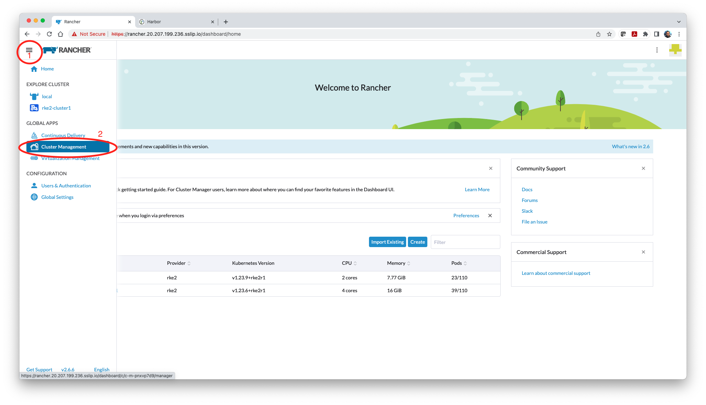

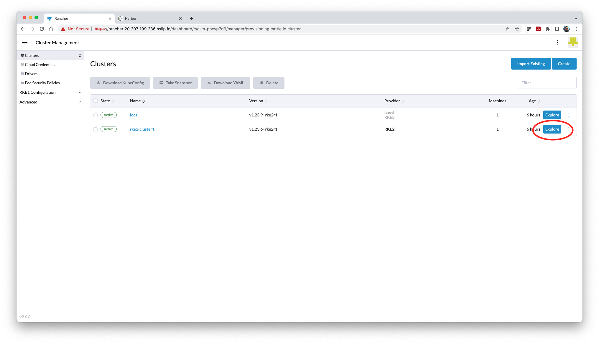

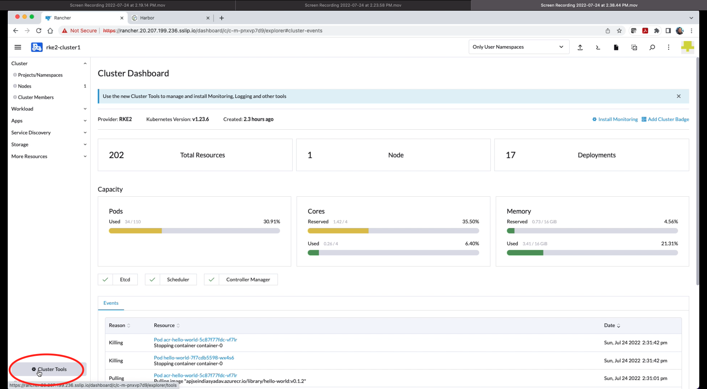

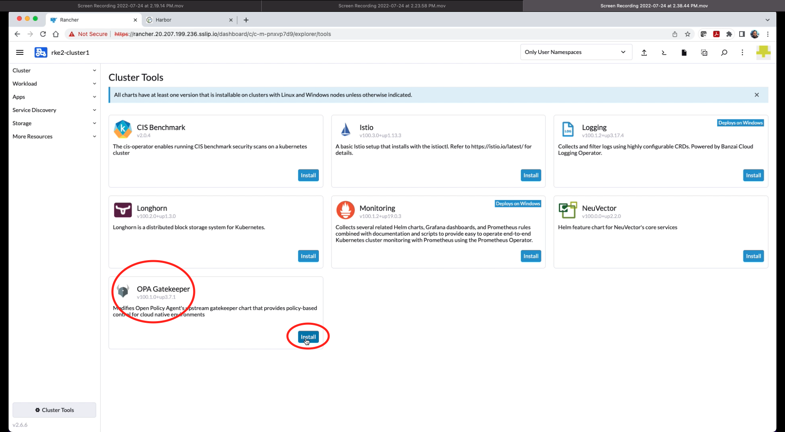

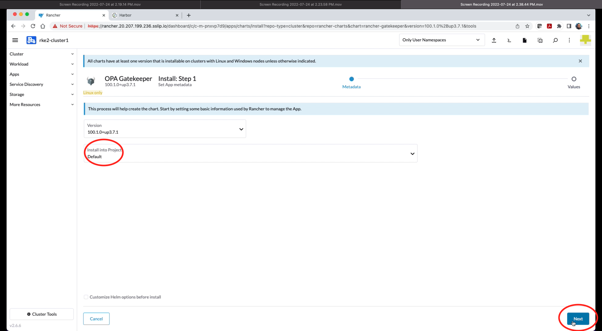

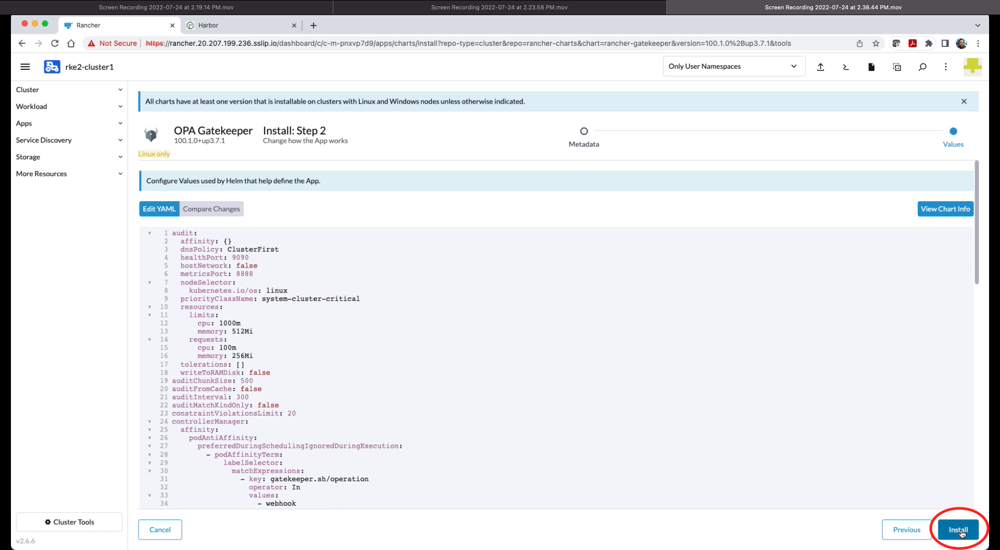

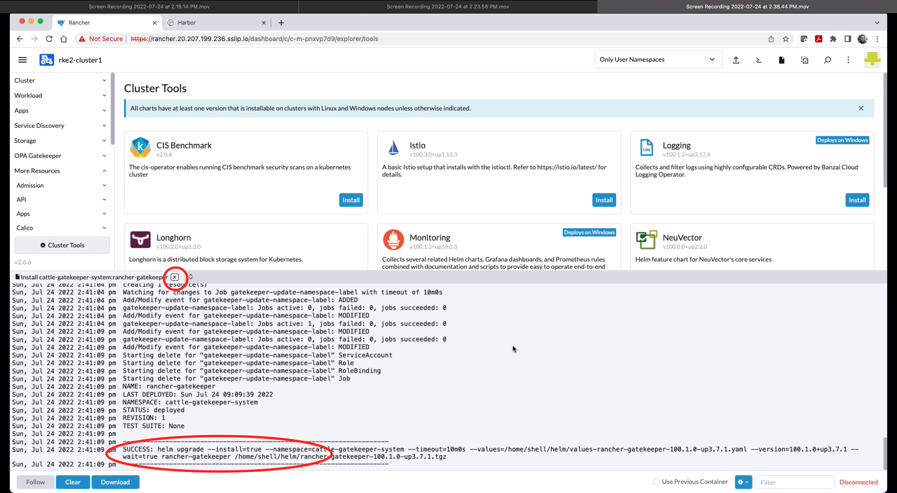

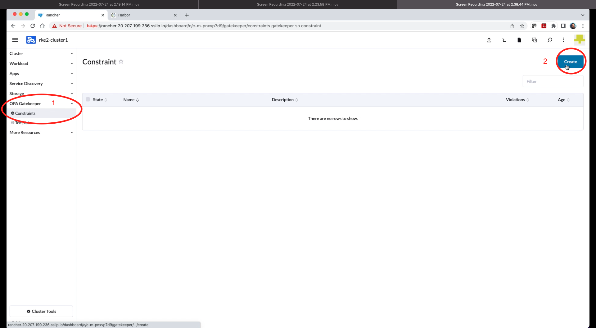

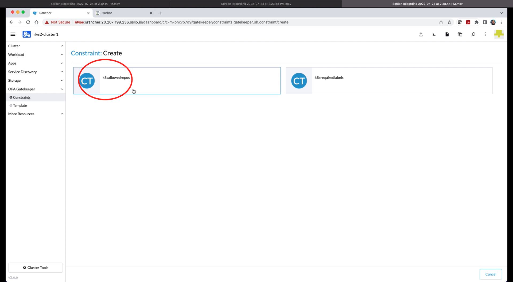

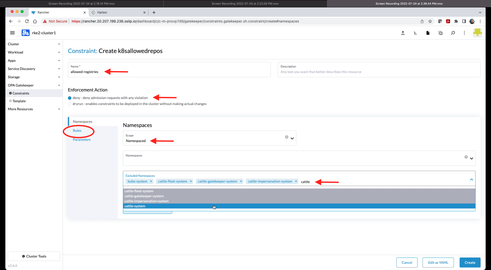

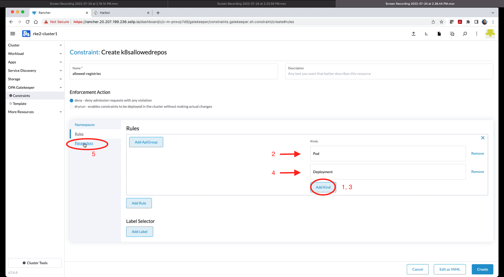

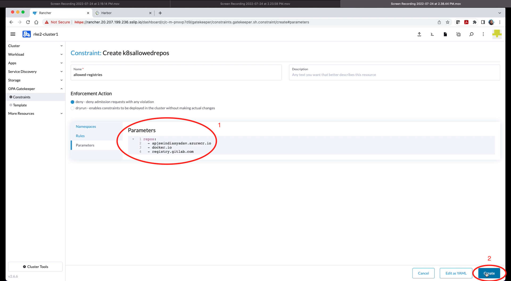

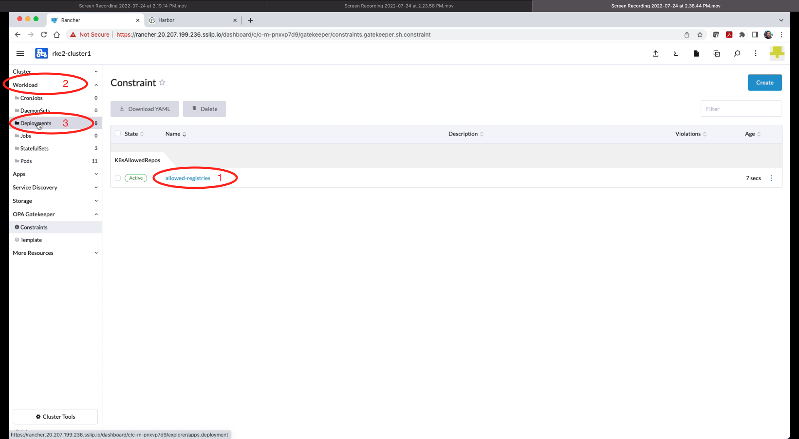

