# Lab 3 A - Installing OPA and setting up OPA constraint on RKE2 cluster

This exercise is independent. We'll experience ease of installing Open Policy Agent (OPA) from Rancher cluster tools and quickly setup the constaint to allow only specific registries for deployment. 


## Action 1: Install Open Policy Agent (OPA) 

This action will involve 6 steps from 3A.1 to 3A.6

**Step 3A.1)** Ensure that you are logged in to the Rancher (Refer to the Step 1 of section **Before We Begin**). Click on `rke2-cluster1 ` link from the Rancher home page.

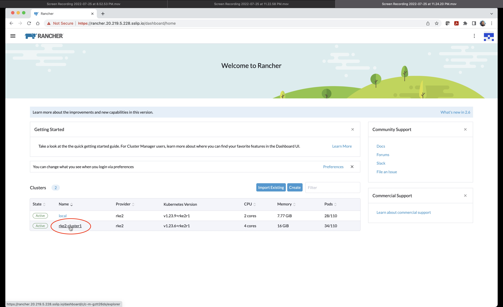


**Step 3A.2)** Now click on `Cluster Tools` on the botton of the left hand side static menu.  

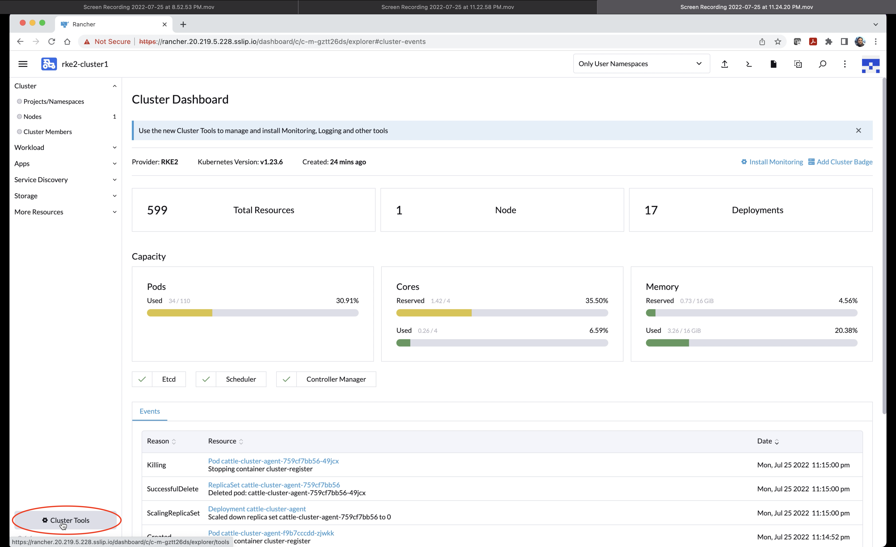


**Step 3A.3)** Identify **OPA Gatekeeper** card and click on `Install` button. 

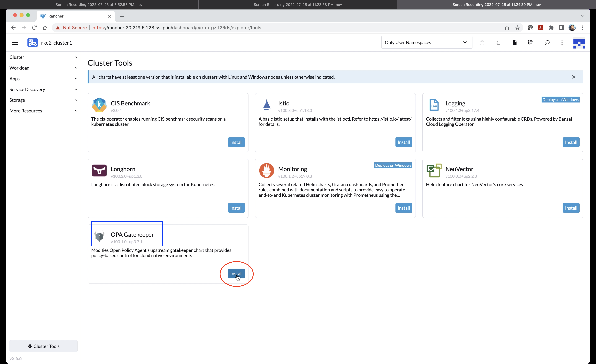


**Step 3A.4)** Choose `Default` value from **Install into Project** and click on `Next` button. 

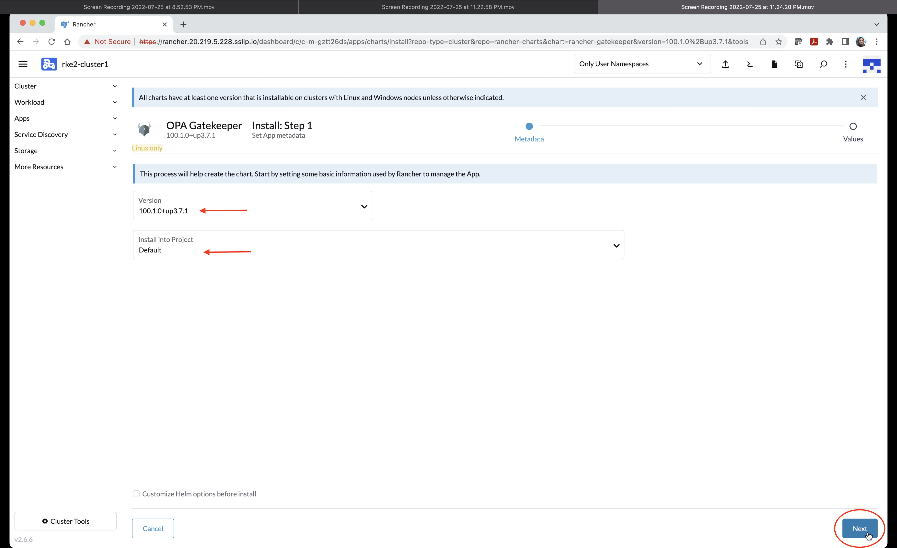


**Step 3A.5)** Now click on `Install` button. 

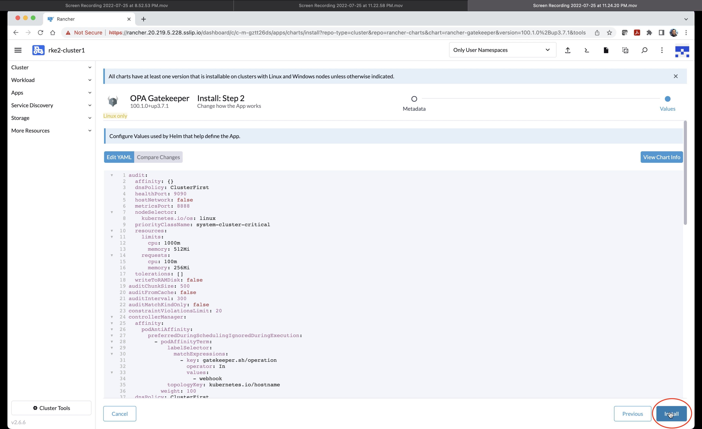


**Step 3A.6)** Verify that installation is successfully completed and SUCCESS message is displayed. Close the logging screen by clicking on "x" button.  

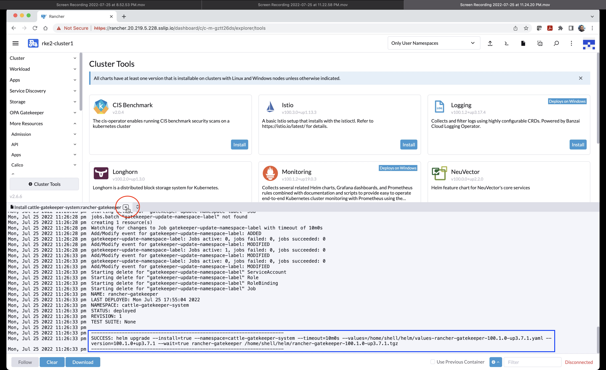


**End of Action 1**


## Action 2: Setup OPA Constraint

This action will involve 7 steps from 3A.7 to 3A.13


**Step 3A.7)** A new **OPA Gatekeeper** menu will appear in left side static menu. Expand menu and click on `Constratint` submenu. 

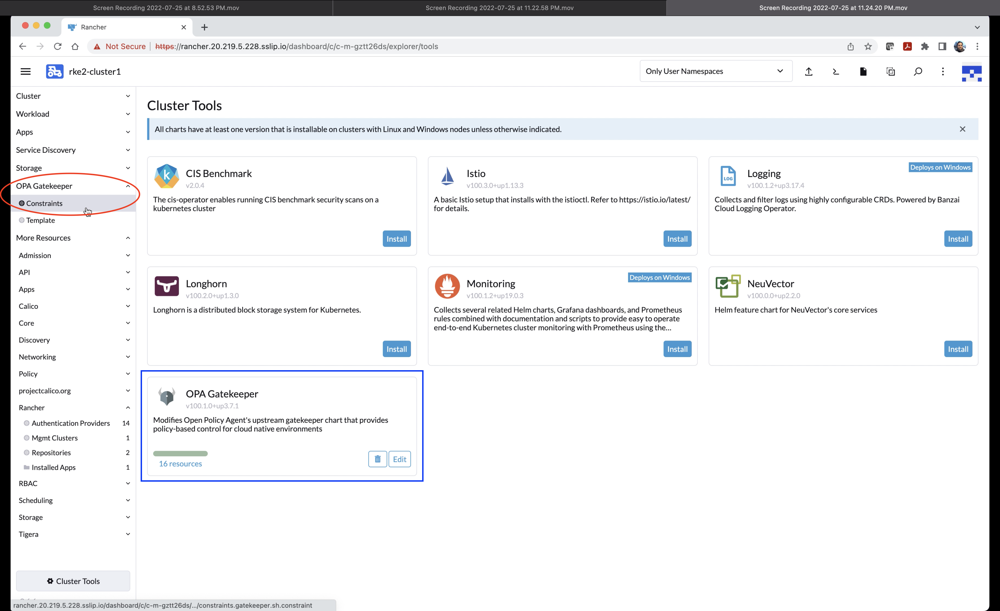


**Step 3A.8)** Click on `Create` to proceed. 

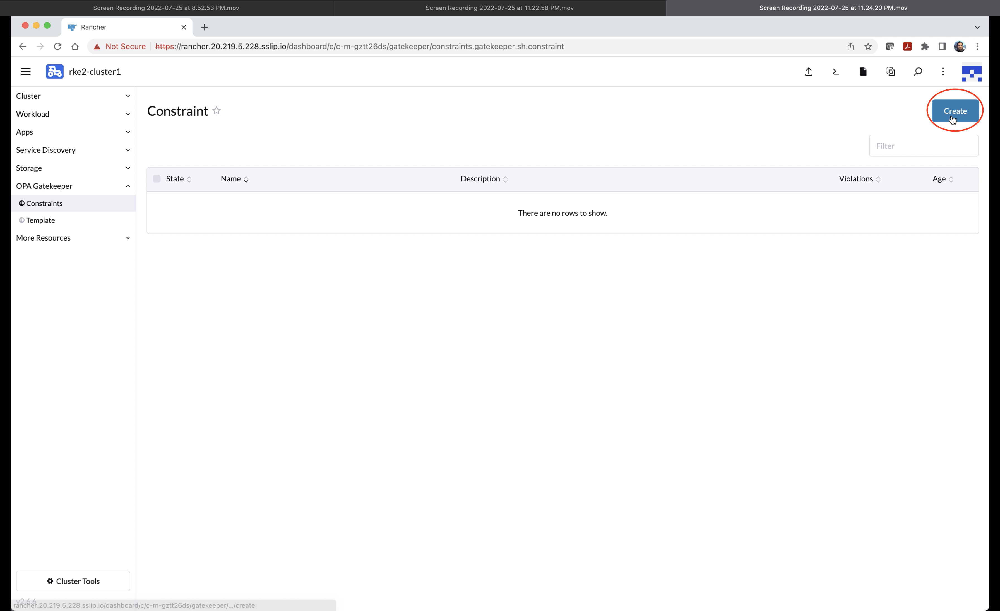


**Step 3A.9)** Select `k8sallowedrepos` from the screen. 

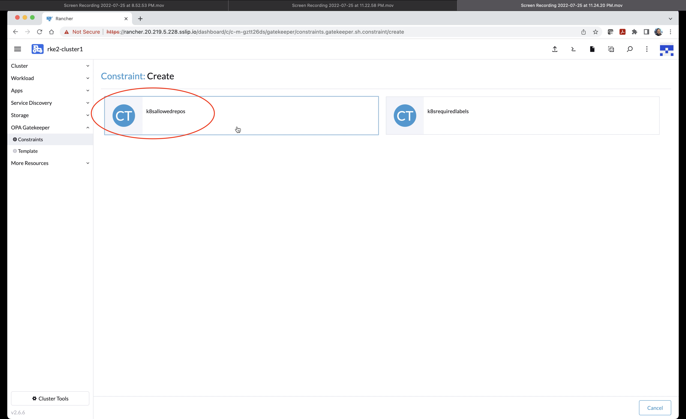


**Step 3A.10)** Fill in the following details and click on `Rules` link. 

`Name : user's choice e.g. allowed-registries`

`Enforcement Action : deny-deny admission request with any violation (Default)`

`Scope : Namespaced (From the dropdown)`

`Excluded Namespaces : kube-system, cattle-* (Manually choose all "cattle-" namespces)`

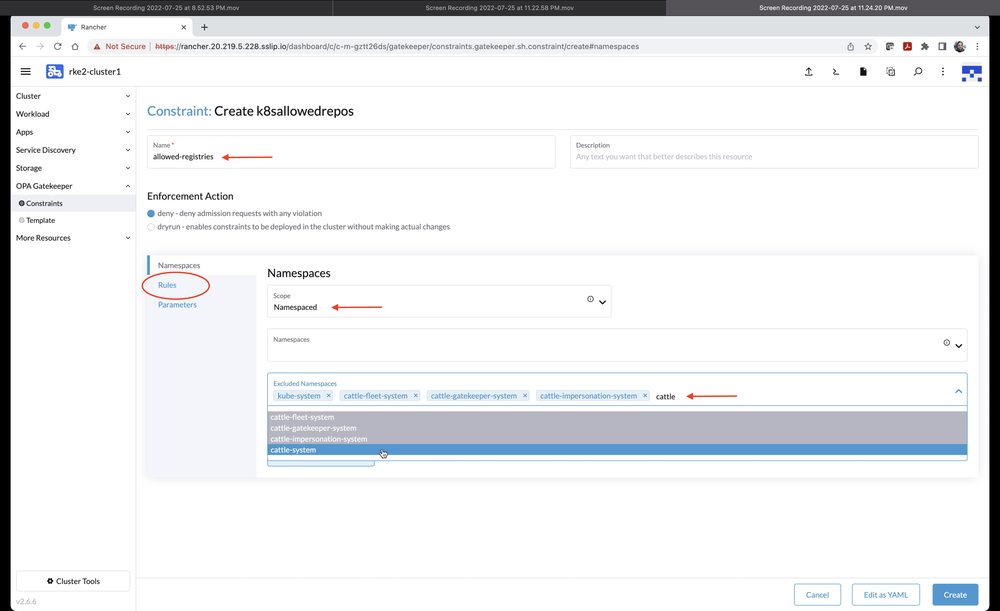


**Step 3A.11)** Click on Add `Kind` button twice to create two rows for Kinds values. Fill `Pod` and `Deployment`. Now click on `Parameters` link.  

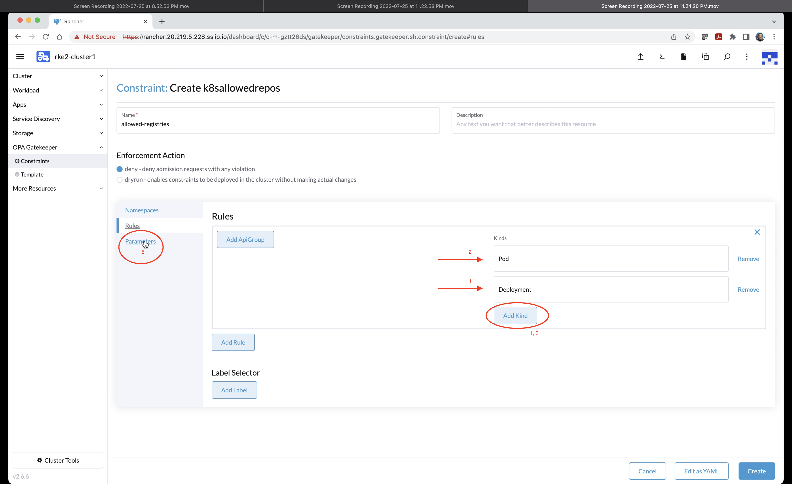


**Step 3A.12)** Specify following yaml values and click `Create`. Make sure that Harbor url is provided correctly as per your allocation e.g. `harbor.20.207.199.86.sslip.io`. In this scenario, Harbor is allowed while Docker Hub (Public Registry) doesn't exisit in allowed list and hence the deployment from docker hub will be blocked.  

```yaml
repos:
 - harbor.yy.yy.yy.yy.sslip.io
 - docker.io
 - registry.gitlab.com
```

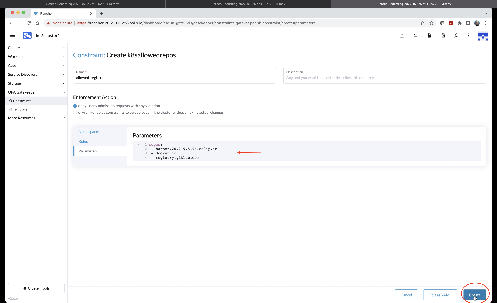


**Step 3A.13)** Verify that constraint is successfully created. 

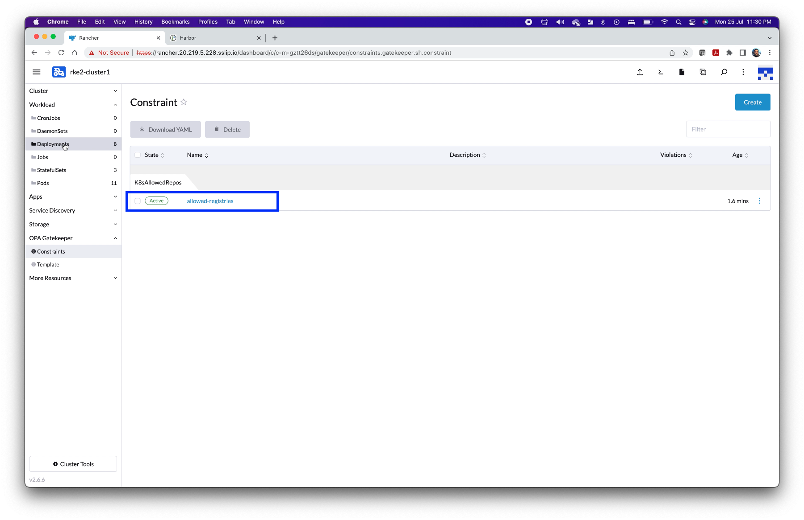

**End of Action 2**

**End of Exercise 3A**

Continue to: [Exercise 3B-Validate OPA Gatekeeper](https://github.com/dsohk/rancher-private-registry-workshop/blob/main/docs/Exercise-03B-TestOPAConstraintForHarborDocker.md)


