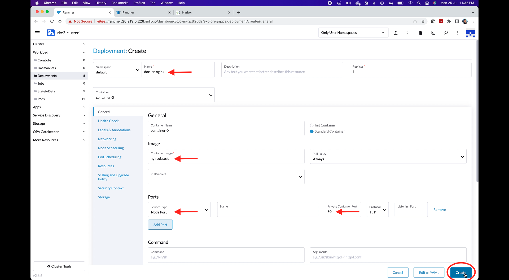
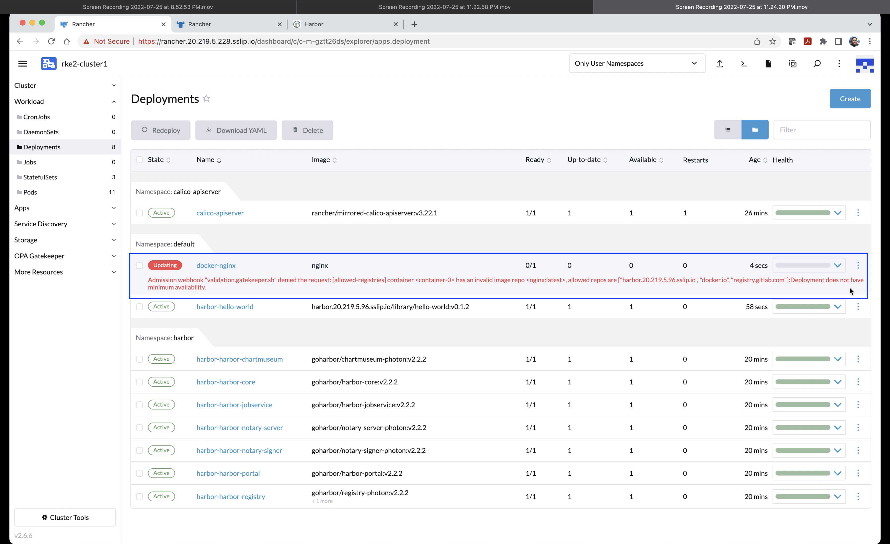
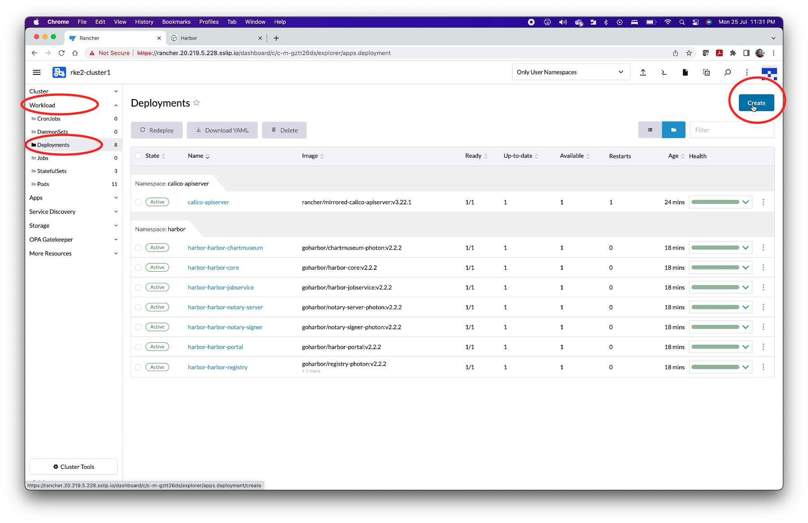
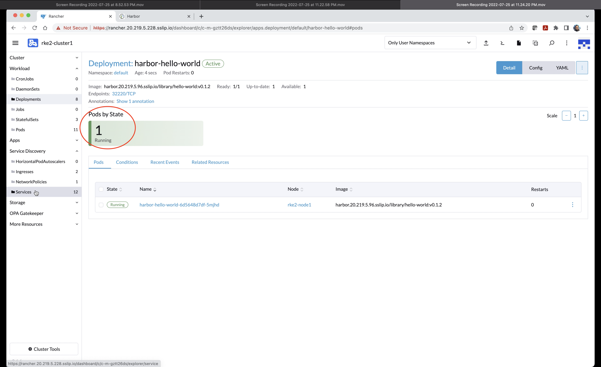
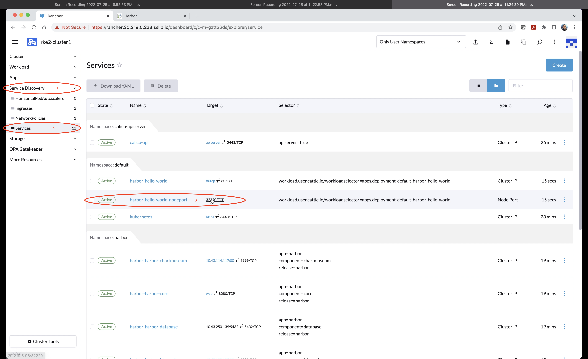

# Lab 3 B - Validate OPA Gatekeeper

This exercise will continue from the previous Exercise 3A. We'll deploy a sample application rancher's hello-world from Harbor registry and ACR respectively to validate OPA Constraint.  

## Action 1: Validate deployment - pulling container image from Docker 

This action will involve 3 steps from 3B.4 to 3B.6

**Step 3B.1)** Make sure that you are at the Deployment screen in Rancher (Click on `Workload` option from the left hand static menu and select `Deployments` sub menu.) and click on `Create`. 

**Step 3B.2)** Fill in following details and click on `Create`

`Namespace : default`

`Name : user's choice e.g. docker-nginx`

`Container Image : nginx:latest`

`Pull Seceret : Not required `

`Service Type : Node Port (From the dropdown)`

`Private Container Port : 80`

**Step 3B.3)** Verify that deployment is failed due to the fact that public regustry docker hub isn't allowed by the OPA Gatekeepr Constraint. 

**End of Action 1**

## Action 2: Validate deployment - pulling container image from Harbor 

This action will involve 6 steps from 3B.4 to 3B.9

**Step 3B.4)** Make sure that you are at the Deployment screen in Rancher (Click on `Workload` option from the left hand static menu and select `Deployments` sub menu.) and click on `Create`. 

**Step 3B.5)** Fill in following details and click on `Create`. 

`Namespace : default`

`Name : user's choice e.g. harbor-hello-world`

`Container Image : harbor.yy.yy.yy.yy.sslip.io/library/hello-world:v0.1.2` To copy the image pull command follow the Notes*. 

Private registry can be directly configured during cluster setup and user need not to know or enter the registry url along with the image name. For visibility purpose, exercise is designed in this way to manually enter complete path.  

`Pull Seceret : as specified in Step 2A.5 (From dropdown) e.g. harbor-registry ` -- This step is required only when pulling image from project which is private. 

`Service Type : Node Port (From the dropdown)`

`Private Container Port : 80`

Notes*: 

a) Switch to the Harbor portal (Make sure you are logged in). 

b) Navigate to `Projects > library > hello-world > sha256:xxxxxxxx`

c) Click on copy icon `[[]` under **Pull Command** column name. 

d) Pull command will be copied to clipboard. You may choose to save it to any text editor of your choice. Ommit `docker pull` statement while entering `Container Image` path.

**Step 3B.6)** Verify that deployment is successfully created and click on the hyperlink of the deployment `harbor-hello-world` under **Name** column. 

**Step 3B.7)** Verify that 1 Pod is in Running state. 

**Step 3B.8)** Click on `Service Discovery (1)` option from the left hand static menu and then click on `Services (2)`  submenu under the Service Discovery. Now click on the link `3nnnn/TCP (3)` under **Target** column.

**Step 3B.9)** Verify that Rancher's Hello world application is accessible on designated Node Port. 

**End of Action 2**

**End of Exercise 3B**

Continue to: [Bonus Lab Exercise](https://github.com/dsohk/rancher-private-registry-workshop/blob/main/docs/BonusExercise-01.md)